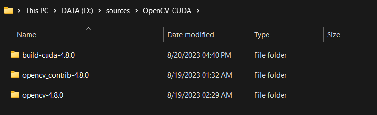
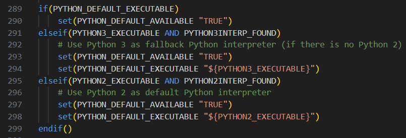
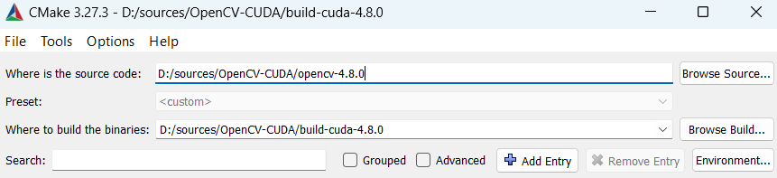
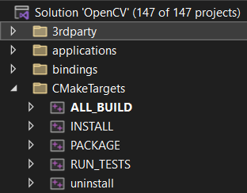

Since pre-built OpenCV binaries do not include CUDA modules, this post is a tutorial for building OpenCV with CUDA on Windows 11. The obvious dvantage of OpenCV CUDA is boosting performance of most functions, you can find evidence [here](https://www.jamesbowley.co.uk/qmd/opencv_cuda_performance.html).

## 1. Prerequisite

There are a couples of softwares or libraries having been downloaded and installed before getting started:

1. Install the [Visual Studio Community 2022](https://visualstudio.microsoft.com/thank-you-downloading-visual-studio/?sku=Community) and select **Desktop development with C++** workload.

2. Download the sources for OpenCV from GitHub by cloning the repositories ([opencv](https://github.com/opencv/opencv) and [opencv_contrib](https://github.com/opencv/opencv_contrib)).



After downloading, you can indicate the OpenCV's version you want to. For the current version, you can run the following command in **Command Prompt** at OpenCV's repositories:

```shell
git checkout tags/4.8.0
```

3. Install the latest stable version (not release candidate -rc) of [CMake](https://cmake.org/download/).

4. Install the latest version of [NVIDIA CUDA Toolkit](https://developer.nvidia.com/cuda-downloads) and add PATH. You can follow this [tutorial](https://visionbike.github.io/posts/create-ml-development-environment-on-window11/).

{}
At the time writting this post, the latest **NVIDIA CUDA Toolkit version 12.2** still makes somes error when building with **OpenCV 4.8.0**, like `error C2666: 'operator !=': overloaded functions have similar conversions`. Therefore, if meeting such problem, try installing older version.
{}

5. Register an account and download the latest verson of [NVIDIA DNN CUDA backend](https://developer.nvidia.com/rdp/cudnn-download) for the version of CUDA. Extract the downloaded **.zip** file and copy **bin**, **include** and **lib** directories to your CUDA installation directory, i.e., `C:\Program Files\NVIDIA GPU Computing Toolkit\CUDA\vxx.x`.

6. Register an account and download the latest version of [NVIDIA VIdeo Codec SDK](https://developer.nvidia.com/nvidia-video-codec-sdk). Extract the downloaded **.zip** file and copy the contents inside **Interface** and **Lib** to **include** and **lib** directories inside the CUDA installation directory.

7. **Optional** - Download and install the latest version of [Gstreamer](https://gstreamer.freedesktop.org/download/#toolchain-compatibility-notes).

8. Download and install the lastest version of [mambaforge](https://github.com/conda-forge/miniforge/releases/latest/download/Mambaforge-Windows-x86_64.exe) to call OpenCV CUDA routines from python.

## 2. Create virtual environtment from Mambaforge

To bind OpenCV for python3 without any conflit package installation, you should create an new virtual environment for the installation.

```shell
mamba create -n opencv-cuda python=3.10
```

Activate the created environment and install **numpy** package.

```shell
mamba activate opencv-cuda
mamaba install numpy
```

## 3. Build OpenCV with CMake

### Preparation

Create a **build** folder with your OpenCV extracted folders.


Edit the prioeiry of Python3 installation in `OpenCVDetectPython.cmake` file inside **opencv-x.x.x/cmake** folder.



### Build GUI Build Configuration

Open Cmake GUI and provide the paths to the OpenCV and target build folders.



Hit **Configure** and select **x64** for the **Optional platform for generator**, then hit **finish** to start the configuration.

Once the configuration is done, edit the following parameters:

| Parameter | Value |
|---|---|
| CMAKE_INSTALL_PREFIX | path of opencv **installation** |
| ENABLE_FAST_MATH | ✅ |
| WITH_CUDA | ✅ |
| BUILD_opencv_world | ✅ |
| BUILD_opencv_python3 | ✅ |
| OPENCV_DNN_CUDA | ✅ |
| OPENCV_EXTRA_MODULES_PATH | path of **modules** directory in **opencv_contrib-x.x.x** |
| OPENCV_PYTHON3_VERSION | ✅ |
| PYTHON3_EXECUTABLE | path of python3 executable in virtual env, i.e., **C:/Users/ntthi/mambaforge/envs/opencv-cuda/python.exe** |
| PYTHON3_INCLUDE_DIR | path of **include** folder in the virtual env, i.e., **C:/Users/ntthi/mambaforge/envs/opencv-cuda/include** |
| PYTHON3_LIBRARY | path of **.lib** file in the virtual env, i.e., **C:/Users/ntthi/mambaforge/envs/opencv-cuda/libs/python310.lib** |
| PYTHON3_NUMPY_INCLUDE_DIRS | path of **numpy** in the virtual env, i.e., **C:/Users/ntthi/mambaforge/envs/opencv-cuda/Lib/site-pakages/numpy/core/include** |
| PYTHON3_PACKAGES_PATH | path of **site-packages** in the virtual env, i.e., **C:/Users/ntthi/mambaforge/envs/opencv-cuda/Lib/site-pakages** |

Note that the path separator hase to be "/" , *not* "\". 

Hit **Configure again** again and check edit more parameters:

| Parameter | Value |
|---|---|
| CUDA_FAST_MATH | ✅ |
| CUDA_ARCH_BIN | version of computing capability, i.e., **8.6** |
| WITH_CUBLAS | ✅ |
| WITH_CUDNN | ✅ |
| WITH_CUFFT | ✅ |

The CUDA_ARCH_BIN corresponding to your GPU is the value found in the left column of the [GPU support table](https://en.wikipedia.org/wiki/CUDA#GPUs_supported). For instance, "8.6" fir the RTX 3070 Ti.

If you do not want to create shared lib and make sure the opencv python libraries is installed, edit the following parameters:

| Parameter | Value |
|---|---|
| BUILD_SHARED_LIBS | 🔳 |
| OPENCV_FORCE_PYTHON_LIBS | ✅ |

Hit **Configure** at the last time and then hit **Generate**.

### Build the project with Visual Studio

Open project `OpenCV.sln` created in the build folder. Go to **Tools > Options...**, then uncheck the last parameter in **Projects and Solutions > Web Projects**.


This setting may help to prevent the `ImportError: DLL load failed while importing cv2: The specified module could not be found.` error.

To build the OpenCV project, change **Debug** mode to **Release**. In the solution explorer expand **CMakeTargets**, right-click **ALL_BUILD** and select Build. This will take about an hour.



Then repeat the step for **INSTALL** (below **ALL_BUILD**). Check for error in the two building steps. If everything is fine, you are done.

### Check Installation and Troubleshooting

To verify the Python installation, activate the virtual environment for OpenCV install and try this code:

```python
import cv2
print(cv2.__version__)
print(cv2.cuda.getCudaEnabledDeviceCount())
```

If it works, congratulations you are good to go!

If you meets the problem `ImportError: DLL load failed while importing cv2: The specified module could not be found.`, it may lack the library's binaries. One solution is to edit **config.py** in **C:/Users/ntthi/mambaforge/envs/opencv-cuda/Lib/site-packages/cv2**.

```python
import os

BINARIES_PATHS = [
    os.path.join('C:/opencv-cuda-4.8.0', 'x64/vc17/bin'),
    os.path.join(os.getenv('CUDA_PATH', 'C:/Program Files/NVIDIA GPU Computing Toolkit/CUDA/v12.1'), 'bin'),
    os.path.join('C:/gstreamer/1.0/msvc_x86_64', 'bin'),
] + BINARIES_PATHS
```

These binary paths are from installed OpenCV, CUDA and Gstreamer (if installed).

For other bugs and problems, I refer you to the [chrismeunier](https://github.com/chrismeunier/OpenCV-CUDA-installation/blob/main/README.md) and [Bowley](https://jamesbowley.co.uk/accelerate-opencv-4-4-0-build-with-cuda-and-python-bindings/#troubleshooting)'s troubleshooting tutorial.

## Reference

- [Build OpenCV (including Python) with CUDA on Windows](https://www.jamesbowley.co.uk/qmd/opencv_cuda_python_windows.html).
- [OpenCV CUDA installation](https://github.com/chrismeunier/OpenCV-CUDA-installation/blob/main/README.md#opencv-cuda-installation).
