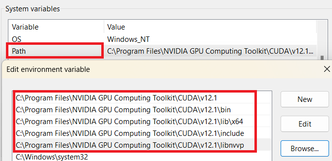

In this post, I will cover the setup of machine learning development environment on both Windows 11. I assume that you have a CUDA-compatible GPU alredy installed on your PC.

To ensure a smooth setup process, it is crucial that you follow the steps in the specified order. Let's begin with the software installations:

- NVIDIA Drivers.
- Microsoft Visual Studio 2022 (Community version).
- NVIDIA CUDA Toolkit.
- NVIDIA cuDNN.
- Mambaforge (similar to Anaconda for Python).

However, if you previously had NVIDIA drivers installed on your computer, it is essential to uninstall all NVIDIA applications before proceeding further. To uninstall the NVIDIA applications, follow these steps:

1. Open the "Install Apps" on your Windows 11 PC.
2. Scroll down untill you find NVIDIA applications. 
3. Click to "..." button on the right and uninstall all NVIDIA GPU drivers and any associated software. 

## 1. Install NVIDA Drivers

To install the latest NVIDA drivers on Windows,  you can utilize [**GeForce Experience**](https://www.nvidia.com/en-gb/geforce/geforce-experience/), which ease the installation process.

Once you have completed downloading **GeForce Experience**, launch it and you can get start.

{}
Upon launching, you will be prompted to log in to your **NVIDIA account**. If you don't have an account already, you can create one.
{}

There are two options for the installation:

- **Experess Installation**: This option will automatically determine which drivers you need and then install them without requesting permission.
- **Custom Installation**: This option gives you more control over the installation process. You can choose additional options and settings based on your preferences. Furthermore, a 'clean installation' option may be presented, allowing you to restore all settings to their default values and remove any previously created profiles. 

After the installation is complete, your NVIDIA graphics card drivers will be set up on your Windows system.

## 2. Install Visual Studio 2022 Community

Visual Studio is required for the installation of the NVIDIA CUDA Toolkit. If you try to install NVIDIA CUDA Toolkit for Windows without installing Visual Studio, you will get the following error when downloading CUDA Toolkit. 

You can install the latest version of [Visual Studio Community](https://visualstudio.microsoft.com/thank-you-downloading-visual-studio/?sku=Community), selecting the **Desktop development with C++** workload shown in the image below. 

If you already have an installation ensure that the correct workload is installed and that you have updated to the latest version.

## 3. Install NVIDIA CUDA Toolkit.

To get the latest version of NVIDIA CUDA Toolkit, you can visit the [NVIDIA Developer website for CUDA Toolkit](https://developer.nvidia.com/cuda-downloads). You can also download previous versions from the [Archive of Previous CUDA Releases](https://developer.nvidia.com/cuda-toolkit-archive) under the Resources section on the same page given above.

On the CUDA Toolkit dowload page, choose the appropriate CUDA Toolkit version based on your operating system (Windows) and architecture (x86_64 for most systems). 

Once the download is complete, locate the downloaded CUDA Toolkit installer file and double-click on it to start the installation process. Follow the on-screen instructions provided by the installer.

- Choose the installation location on your system.
- Select the components you want to install. It is recommended to include the CUDA Toolkit, CUDA Samples, and CUDA Visual Studio Integration if you are using Visual Studio for development.
- Choose the appropriate options based on your preferences during the installation process.


After the installation is complete, you may need to set up environment variables to ensure that your system recognizes the CUDA Toolkit.

- Open the Start menu and search for "Environment Variables".
- Select "Edit the system environment variables".
- In the System Properties window, click on the "Environment Variables" button.
- Under "System variables", click on "New" to add a new variable.
- Set the variable name as `CUDA_PATH` and the variable value as the installation path of the CUDA Toolkit (e.g., `C:\Program Files\NVIDIA GPU Computing Toolkit\CUDA\v<version>`). 

{}
You can verify the installation by opening a command prompt and running the following command.

```ps
nvcc --version
```

If the installation was successful, you should see the CUDA version information displayed.
{}

The NVIDIA CUDA Toolkit is now installed on your system. This toolkit provides the necessary libraries, compilers, and tools for developing and running CUDA-accelerated applications and machine learning models.

## 3. Install NVIDIA cuDNN

uDNN (CUDA Deep Neural Network Library) is a GPU-accelerated library developed by NVIDIA specifically designed and colaborated withNVIDA CUDA Toolkit to accelerate deep neural network computations. By utilizing cuDNN, deep learning frameworks can leverage the parallel processing capabilities of NVIDIA GPUs, leading to significant speed improvements in training and inference of deep neural networks.

To download the latest version of NVIDIA cuDNN, you can visit [NVIDIA Developer website for CUDA cuDNN](https://developer.nvidia.com/rdp/cudnn-download). On the cuDNN page, you will need to create or log in to your NVIDIA Developer account in order to access the cuDNN download files. If you don't have an account, you can create one for free.

Once you are logged in, choose the appropriate cuDNN version based on your CUDA Toolkit version and operating system. Make sure to select the version that is compatible with your installed CUDA Toolkit.


After the download is complete, locate the downloaded cuDNN package file and extract its contents to a desired location on your system. The extracted package will contain several files and folders, including the `bin`, `include`, and `lib` directories.


Copy these folder from the extracted cuDNN package to the corresponding directories in your CUDA Toolkit installation, i.e., `C:\Program Files\NVIDIA GPU Computing Toolkit\CUDA\v<version>`.

After copying the files, cuDNN is successfully installed and integrated with your CUDA Toolkit. 

Finally, You need to set the variable name as `CUDNN` and the variable value as the installation paths of the cuDNN folders. You also add these path to "System variables"'s Path



## 4. Install Mambaforge for Windows

[Mambaforge](https://mamba.readthedocs.io/en/latest/index.html) is a distribution of the Python programming language that serves as an alternative to Anaconda. It provides a comprehensive environment for scientific computing and data science, offering a collection of pre-installed packages commonly used in these domains. 

Mambaforge is designed to facilitate package management and create isolated Python environments for different projects.

You can download the Windows version from [this link](https://github.com/conda-forge/miniforge#mambaforge) and start installing.

Once the installation is complete, add the Mambaforge installation directory to the "User Variable"'s Path.


{}
You can verify the installation by opening a command prompt and running the following command.

```ps
mamba --version
```

If the installation was successful, you should see the Mambaforge version information displayed.
{}

## Conclusion

By following these steps and installing the required software, you will have a machine learning development environment set up on your Windows 11 system. This environment will provide the necessary tools and libraries for GPU-accelerated computing and Python package management.

## Reference

- [Install CUDA and CUDNN on Windows & Linux](https://medium.com/geekculture/install-cuda-and-cudnn-on-windows-linux-52d1501a8805).
- [Installing Latest TensorFlow version with CUDA, cudNN and GPU support on Windows 11 PC](https://medium.com/@Gunter-Pearson/installing-latest-tensorflow-version-with-cuda-cudnn-and-gpu-support-on-windows-11-pc-e41fac5c5795).
- Microsoft Visual Studio: [https://visualstudio.microsoft.com/free-developer-offers/](https://visualstudio.microsoft.com/free-developer-offers/).
- NVIDIA CUDA Toolkit: [https://developer.nvidia.com/cuda-toolkit](https://developer.nvidia.com/cuda-toolkit).
- NVIDIA cuDNN: [https://developer.nvidia.com/cudnn](https://developer.nvidia.com/cudnn).
- Mambaforge: [https://github.com/conda-forge/miniforge#mambaforge](https://github.com/conda-forge/miniforge#mambaforge)
