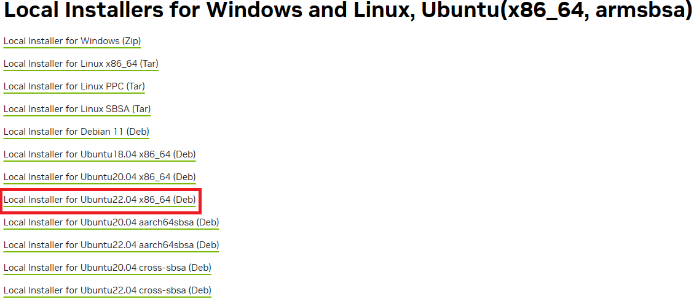
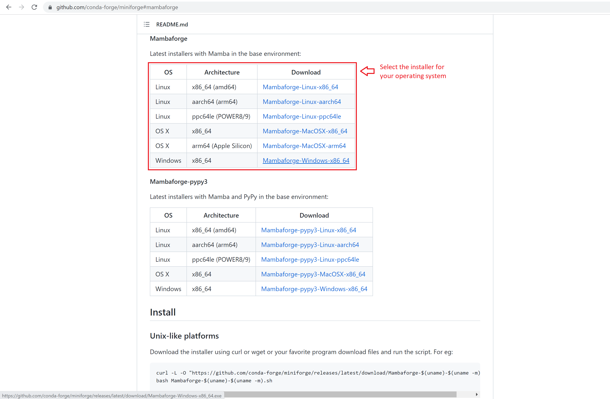

To get started with running CUDA on WSL, you need to instal NVIDIA Driver on Windows 11 with a compatible GeForce or NVIDIA RTX/Quadro card from this [link](https://www.nvidia.com/Download/index.aspx).

Note that you **only need to install NVIDIA Driver for Windows. Do not install any Linux Driver in WSL**.

The latest NVIDIA Windows GPU Driver will fully support WSL 2. With CUDA support in the driver, existing applications compiled on a Linux system for the same target GPU can run unmodified within the WSL environment. Once NVIDIA Windows GPU Driver is installed in the system, the CUDA driver will be stubbed inside the WSL 2 as `libcuda.so`. Therefore, you only use a separate CUDA Toolkit for WSL 2 which does not contain the NVIDIA Linux GPU Driver.

## 1. Install NVIDIA CUDA Toolkit for WSL 2

First remove the old GPG key from your WSL machine

```shell
sudo apt-key del 7fa2af80
```

Download [CUDA Toolkit for WSL 2](https://developer.nvidia.com/cuda-downloads?target_os=Linux&target_arch=x86_64&Distribution=WSL-Ubuntu&target_version=2.0&target_type=deb_local).

```shell
wget https://developer.download.nvidia.com/compute/cuda/repos/wsl-ubuntu/x86_64/cuda-wsl-ubuntu.pin
sudo mv cuda-wsl-ubuntu.pin /etc/apt/preferences.d/cuda-repository-pin-600
wget https://developer.download.nvidia.com/compute/cuda/12.2.1/local_installers/cuda-repo-wsl-ubuntu-12-2-local_12.2.1-1_amd64.deb
```

Then, folow the installation instruction.

```shell
sudo dpkg -i cuda-repo-wsl-ubuntu-12-2-local_12.2.1-1_amd64.deb
sudo cp /var/cuda-repo-wsl-ubuntu-12-2-local/cuda-*-keyring.gpg /usr/share/keyrings/
sudo apt-get update
sudo apt-get -y install cuda
```

Verify that CUDA is successfully installed by command

```shell
nvidia-smi
```

## 2. Install NVIDIA CuDNN

You can find the coresponding installation file from [this](https://developer.nvidia.com/rdp/cudnn-archive). Here you need to register and login to download it.



You can use Windows to download installation files then move to Ubuntu system in WSL 2. The WSL system is mapped to `\\wsl$\Ubuntu-22.04` and Windows drives are mounted under `/mnt` and can be accessed directly.

Once completed, it can be installed with following commands

```shell
sudo dpkg -i cudnn-local-repo-ubuntu2204-8.9.3.28_1.0-1_amd64.deb
sudo cp /var/cudnn-local-repo-ubuntu2204-8.9.3.28/cudnn-local-*-keyring.gpg /usr/share/keyrings/
sudo apt-get -y update
sudo apt-get -y upgrade
```

{}
Once the installattion is completed, you may receive the following error:

```bash
/sbin/ldconfig.real: /usr/lib/wsl/lib/libcuda.so.1 is not a symbolic link
```

The reason may be the property of read-only of the directory. You can create other directory then link executable from `/usr/lib/wsl/lib/` to the new directory.

```shell
cd /usr/lib/wsl
sudo mkdir lib2
sudo ln -s lib/* lib2
sudo ldconfig
```

Then change `/usr/lib/wsl/lib` in the file `/etc/ld.so.conf.d/ld.wsl.conf` to `/usr/lib/wsl/lib2`.

```bash
# This file was automatically generated by WSL. To stop automatic generation of this file, add the following entry to /etc/wsl.conf:
#[automount]
#ldconfig = false
/usr/lib/wsl/lib2
```

Restarting WSL after setting will automatically restore, if you don’t want to restore, you need to modif `/etc/wsl.conf`

```bash
[automount]
ldconfig = false
```

{}

## 3. Set up Python environment using Mambaforge

Python environment allows to manage separatelly different installations of Python and modules. It is useful when you have many projects running different version of Python and modules. It also help to manage installed modules for publish or reproduce.

There are different ways to create a python virtual environment, including built-in `venv`, `Conda` and `Anaconda`. 

`Conda` is a packaging tool and installer that aims to handle library dependencies outside of the Python packages as well as the Python packages themselves. For non preinstalled package manager, `Miniconda`, an installation of Conda, will be a good option.

`Anacond`a is an installation of Conda that comes pre-loaded with a bunch of packages for scientific computing, i.e., `numpy`, `matplotlib`, `scipy`, etc. It also comes with IDE, Jupyter notebooks out of the box. This is helpful for beginers, but doesn't give much control.

`Mamba` is a package manager which can be used with Python. Unlike `Conda`, it uses the C/C++ implementation to speed up the package installation. Read more about `mamba` in [here](https://focalplane.biologists.com/2022/12/08/managing-scientific-python-environments-using-conda-mamba-and-friends/). To install `mamba`, access [its repo](https://github.com/conda-forge/miniforge) and pick the Mabaforge installer for your operating system.

Remember to run `conda init` at the end of your installation in your shell to activate the `mamba` command.



### Create and use virtual environments

The command using `mamba` is similar to the `conda` command.

- Create new environment

```shell
mamba create -n <envname> python=<version>
```

- Activate an environment

```shell
mamba activate <envname>
```

- Deactivate environment

```shell
mamba deactivate
```

- Delete an environment

```shell
mamba env remove -n <envname>
```

- Show all created environments

```shell
mamba env list
```

### Working with Python packages

**Remember to activate an environment first, do not install any packages in your base environment!**

- Install python packages

```shell
mamba install <package>[=version] [-c <channelname>]
```

When installing a package, you can optionally indicate specific additional channel that the packages are posted by community. `conda-forge` is one of most common additional channels.

- Delete packages

```shell
mamba remove <package>
```

- Show all installed packages in the virtual environment

```shell
mamba list [-n <envname>]
```

## Reference

- [Install CUDA and CUDNN on Windows & Linux](https://medium.com/geekculture/install-cuda-and-cudnn-on-windows-linux-52d1501a8805).
- [CUDA on WSL User Guide](https://docs.nvidia.com/cuda/wsl-user-guide/index.html).
- [Machine learning environment build: WLS2+Ubuntu+CUDA+cuDNN](https://visualstudio.microsoft.com/free-developer-offers/).
- [Getting started with Mambaforge and Python](https://biapol.github.io/blog/mara_lampert/getting_started_with_mambaforge_and_python/readme.html).
- [Tutorial: Setting up Python enviroments with Mambaforge](https://ross-dobson.github.io/posts/2021/01/setting-up-python-virtual-environments-with-mambaforge/).

