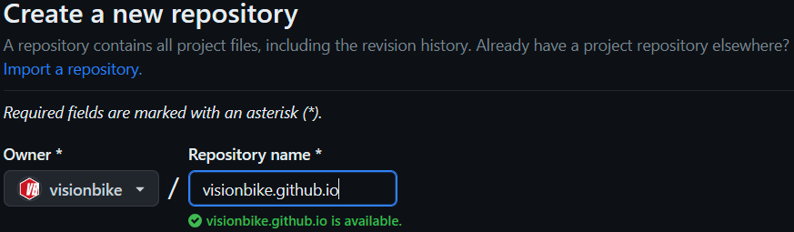
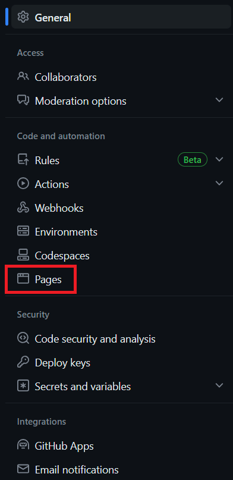

Creating a personal blog with technical content is a excellent way to enhance your writting skill, take your notes and share your experience with others on the Internet. 
Ideally, we should have following goals when creating and mantaining a blog:

1. **No/Low-cost** - Free or as close to free as posisble.
2. **Productive** - Easy to write in and maintain.
3. **Cloud Native** - Utilizes public cloud services for hosting, allowing for infinite scaling.

After researching, I found that using **Markdown**,  **Hugo** and **GitHub Pages**  is indeed a powerful combination for creating and maintaining a cost-effective, productive, and cloud-native blog:

* [**Markdown**](https://daringfireball.net/projects/markdown/) - A markup language that is extremely easy to read, write natively and can be converted into HTML.
* [**Hugo**](https://gohugo.io/) - A static site generator written in the Go language that allows for content written in Markdown to be rendered into HTML webpages.
* [**GitHub Pages**](https://pages.github.com/) - A GitHub service that hosts web content (such as HTML webpages) stored in a GitHub repository.

In this post, I will show how to create your own blog for FREE using above technologies. The blog is built using an Linux operating system host (including Window Subsystem for Linux - WSL as in my case).

Here's an outline of the steps you can follow to create your own blog using these technologies:

### 1. Set up GitHub Account

If you don't have one already, creating a GitHub account. GitHub Pages allows you to host your blog for free using a GitHub repository.

### 2. Install Hugo

Before starting, make sure `git` is install in your local machine.

```shell
sudo apt install git
```

Open a terminal and configure Git with your name and email address.

```shell
git config --global user.name "Your Name"
git config --global user.email "your.email@example.com"
```

To verify that Git has been installed successfully, you can check the version using `git --version`. This command will display the installed version of Git.

Now, install Hugo on your Linux operating system host. For Ubuntu user, you can follow this commands.

```shell
sudo apt install hugo
```

For verification, run this command:

```shell
hugo version
```

The Hugo version should be shown if the installation is successfull. 

### 3. Create a new Hugo site

Use `hugo new site` command to create a new Hugo site:

```shell
hugo new site <USERNAME>-hugo -f yml
```

This will set up the basic directory structure and configuration file (`*.yml` format) for your blog. This site will be associated with a GitHub repository where you can store the source code of your blog.

{}
For convenient management and organization, you should name the your site as above format with `<USERNAME>` as the your GitHub's username, i.e., `visionbike-hugo`. It's a helpful tip for keeping track of your projects and ensuring clarity when managing multiple repositories.
{}

Initialize git in the local site for further use.

```shell
cd <USERNAME>-hugo
git init
```

After creating the Hugo site, it's important to associate it with a GitHub repository. You need to create a new repository on GitHub for your blog's source code.



{}
By creating a repository without a `README` file, you can avoid accidental history conflicts when pushing your local project to a fresh repository. You can always add a `README` file later if needed.
{}

Now, link the local site to the GitHub repository by using `remote` command:

```shell
git remote add origin https://github.com/<USERNAME>/<USERNAME>-hugo.git
git banrch -M master
```

Replace `<USERNAME>` with your GitHub's username.

By completing these steps, you have linked your local Hugo site to the GitHub repository. Now you can continue working on your site locally, commit your changes, and push them to the remote repository when ready.

### 4. Install Hugo Theme

nstalling a Hugo theme is a fantastic way to personalize your blog and enhance its visual appeal. You can access free Hugo themes via [this website](https://themes.gohugo.io/).

For my blog, I select the [**PaperModX**](https://github.com/reorx/hugo-PaperModX) theme because of its style and awesome features. To use the theme, I will add its source code by `git submodule` command.

```shell
git submodule add --depth 1 https://github.com/reorx/hugo-PaperModX themes/PaperModX
```

This command adds the **PaperModX** theme repository as a submodule in the `themes/PaperModX` directory of your Hugo site.

{}
If you have already added the submodule before, you can run the following command to reclone it.

```shell
git submodule update --init --recursive
```

For updating the theme, run this command.

```shell
git submodule update --remote --merge
```

{}

### 5. Modify Hugo Configuration

Once you have added the theme, you can configure it in your Hugo site's configuration file (`config.toml` or `config.yml`). Refer to the theme's documentation for specific instructions on customization and configuration options. You will most likely want to modify the following fields:

* **baseURL**: This should be set to the URL GitHub Pages will use to host your blog, which will depend on the name of the GitHub repository you created. If the GitHub repository is named `<USERNAME>.github.io`, then the value of baseURL will be `https://<USERNAME>.github.io/`. If the GitHub repository has any other name, then the value of baseURL will be `https://<USERNAME>.github.io/<REPOSITORY_NAME>/`.
  * For example, my GitHub username is `visionbike`. If the GitHub repository is named `visionbike.github.io`, then the value of baseURL will be `https://visionbike.github.io/`.
  * For example, my GitHub username is `visionbike`. If the GitHub repository is named `visionbike-hugo`, then the value of baseURL will be `https://visionbike.github.io/visonbike-hugo/`.

* **title**: This will be the title of your blog site as it appears at the top of a visitor’s web browser when your site is open. It will also appear underneath your avatar, if one is present.

* **theme**: The name of the theme Hugo should use to render your site. In my example, this will be set to `PaperModX`, since that is the name of the theme I am using.

Example contents of a valid `config.yml` file can be found below.

{}
```yml
# base URL
baseURL: "http://visionbike.github.io/"

# site title
title: "Visionbike - Personal Blog of CV | DSP | ML notes"

# paginate
paginate: 5

# theme config
theme: "PaperModX"
themesdir: "themes"

# global config
enableInlineShortcodes: true
enableRobotsTXT: true
buildDrafts: false
buildFuture: false
buildExpired: false
enableEmoji: true

# css minify for speeding up site
minify:
  disableXML: true
  minifyOutput: true

# site param config
params:
  # environment
  env: "production"
  description: "Visionbike - Personal Blog of CV | DSP | ML notes"

  # color scheme: auto, dark, light
  defaultTheme: "dark"
  disableThemeToggle: true

  # header logo
  logo:
    text: "Visionbike"
    icon: "/images/apple-touch-icon.png"
    iconHeight: 35
    iconWidth: 35

  # profile-mode
  profileMode:
    enabled: true
    title: "Phuc Thanh-Thien Nguyen"
    subtitle: "AI Researcher - Personal Blog of CV | DSP | ML notes"
    imageUrl: "/images/avatar-3d.png"
    imageTitle: "avatar-3d"
    imageWidth: 180
    imageHeight: 180
    buttons:
      - name: Archives
        url: /archives/
      - name: Tags
        url: /tags/
  # home-info-mode
  homeInfoParams:
    title: "Phuc Thanh-Thien Nguyen"
    content: "AI Researcher - Personal Blog of CV | DSP | ML notes"

  # home social icons
  socialIcons:
    - name: github
      url: "https://github.com/visionbike/"
    - name: linkedIn
      url: "https://linkedin.com/in/nttphuc/"

  # post config
  author: "Visionbike"
  showCodeCopyButtons: true
  displayFullLangName: true
  showReadingTime: true
  showWordCount: true
  showPostNavLinks: true
  showBreadCrumbs: true
  enableImageZoom: true

  # search page
  fuseOpts:
    isCaseSensitive: false
    shouldSort: true
    location: 0
    distance: 1000
    threshold: 0.4
    minMatchCharLength: 0
    keys: ["title", "permalink", "summary", "content"]

# laguage config
languages:
  en:
    weight: 1
    # language code
    languageCode: "en"
    # determines default content language: "en", "zh-cn", "fr", "vi", ...
    defaultContentLanguage: "en"
    # menu language
    menu:
      main:
        - name: "Posts"
          weight: 1
          url: "/posts/"
        - name: "Tags"
          url: "/tags/"
          weight: 3
        - name: "Archive"
          url: "/archives/"
          weight: 4
        - name: "Publish"
          url: "/publish/"
          weight: 5
        - name: "About"
          weight: 10
          url: "/about/"
        - name: "Search"
          weight: 100
          url: "/search/"

# for search page
outputs:
  home:
    - HTML
    - RSS
    - JSON

# syntax highlight
pygmentsUseClasses: true
pygmentsCodeFences: true
markup:
  goldmark:
    renderer:
      unsafe: true
  highlight:
    style: doom-one2
    lineNos: false
    codeFences: true
    noClasses: false
```
{}

After modifying your `config.yml` file accordingly, use `git` to commit and push the changes from your local repository to GitHub.

```shell
git add .
git commit -m "modify configuration file, add admonition, change accent color"
git push -u origin master
```

### 6. Create New Hugo Post

That's a great step to create your first blog post using Hugo! To create your first post with the `hugo new` command, execute the following command in the terminal.

```shell
hugo new posts/first-post/index.md
```

This command will create a new folder named `first-post` with new Markdown file `index.md` inside the `content/posts` directory. Creating a new directory for each single post helps you manage your resource better when images, media sources can be store directly in this directory. The Markdown file will contain the template for your first blog post and you can start  writing your content using Markdown syntax.

The contents of the `first-post.md` file will look something like this.

{}
```markdown
---
title: "First Post"
date: 2023-07-04T01:53:57+08:00
draft: true
---
```
{}

To create your first blog post using Hugo, you need to add content to the Markdown file and update the metadata header. In the metadata header, you will find information such as the post's title (`title`), publishing date (`date`), and draft status (`draft`). Change the value of the `draft` field from `true` to `false` to indicate that the post is ready to be published on your blog site. Your can also add other features supported by the installed theme for your post, i.e., comments, share buttons, navigation, etc.

Next, add your desired content to the body of the post. In this case, you can include the line "This is my first post! Hello world!" at the bottom of the file. Feel free to customize the content to reflect your own thoughts and ideas in Markdown syntax.

After modifying your first blog post, you can use `git` to commit and push the changes from your local repository to GitHub.

```shell
git add content/posts/first-post.md
git commit -m "add the first post"
git push -u origin master
```

{}
```markdown
---
title: "First Post"
date: 2023-07-04T01:53:57+08:00
draft: true
---
```
{}

### 7. Test Hugo Configuration

Before hosting your blog to GitHub pages, let’s ensure Hugo can parse the configuration file and build our new blog post successfully. 

In your local machine, you can run `hugo server` command to serve your site locally. 

```shell
hugo server --disableFastRender
```

It will watch for any changes in your files and automatically rebuild your site whenever there are updates. Hugo will provide a local development server address, usually `http://localhost:1313`, where you can access your site.

To parse the configuration and build your site, you can simply run `hugo` command. If Hugo encounters any errors, they will be reported here. If the site is successfully built, then you will see output similar to the following.

```shell
christopher@ubuntu-playground:~/GitHub/blog-hugo/blog$ hugo

                   | EN  
-------------------+-----
  Pages            |  7  
  Paginator pages  |  0  
  Non-page files   |  0  
  Static files     |  2  
  Processed images |  0  
  Aliases          |  1  
  Sitemaps         |  1  
  Cleaned          |  0  

Total in 21 ms
```

### 8. Set Up GitHub Actions Workflow

Lastly, we need to set up a GitHub Actions workflow for automatically building and deploying your blog to GitHub Pages. This workflow is defined by a YAML file in the `.github/workflows` directory structure at the root of the project. First, let’s create this directory.

```console
mkdir -p .github/workflows
```

This command creates the `.github/workflows` directory if it doesn't already exist. The `-p` option ensures that the parent directories are created if needed. 

Then, we will create a new file within the `.github/workflows` directory named `deploy_gh_pages.yaml` with the following contents.

{}
```yaml
---
name: Deploy Hugo site via GitHub Pages

on:
  push:
    branches:
      - master # Set a branch to deploy
  pull_request:

jobs:
  deploy:
    runs-on: ubuntu-22.04
    permissions:
      contents: write
    concurrency:
      group: ${{ github.workflow }}-${{ github.ref }}
    steps:
      - uses: actions/checkout@v3
        with:
          submodules: true # Fetch Hugo themes (true OR recursive)
          fetch-depth: 0 # Fetch all history for .GitInfo and .Lastmod

      - name: Setup Hugo
        uses: visionbike/actions-hugo@v2
        with:
          hugo-version: "latest"
          extended: true

      - name: Build
        run: hugo --minify

      - name: Deploy
        uses: visionbike/actions-gh-pages@v3
        # If you're changing the branch from main,
        # also change the `master` in `refs/heads/master`
        # below accordingly.
        if: github.ref == 'refs/heads/master'
        with:
          github_token: ${{ secrets.GITHUB_TOKEN }}
          publish_dir: ./public
```
{}

The YAML file defines the GitHub Actions workflow. It sets up the deployment process using Hugo and GitHub Pages. The workflow is triggered on a push to the `master` branch, and it uses the specified actions to build and deploy your blog.

You can see more in [this](https://github.com/peaceiris/actions-gh-pages).

After creating this file, use `git` to commit and push the changes from your local repository to GitHub.

```console
git add .github/workflows/deploy_gh_pages.yaml
git commit -m "Add GitHub Actions workflow"
git push -u origin master
```

### 9. Configure GitHub Pages

Next, we need to set up the GitHub Pages component of our blog. This will allow GitHub to automatically build and serve our website whenever changes are made to the underlying repository.

First, left click on the "Settings" tab near the top of the repository. An example is below with the "Settings" button highlighted in red.


In the left hand pane, locate and left click on the “Pages” category. An example is below with the “Pages” category highlighted in red.



By default, GitHub Pages will be disabled for this repository. To enable it, we need to select a branch for GitHub Pages to build and serve our website from. In the middle pane under the “Source” section, left click on the “None” dropdown menu. An example is below with the “None” dropdown menu highlighted in red.

### Reference

- [https://chrisjhart.com/Creating-A-Simple-Free-Blog-Hugo/](https://chrisjhart.com/Creating-A-Simple-Free-Blog-Hugo/).

- [https://github.com/reorx/hugo-PaperModX](https://github.com/reorx/hugo-PaperModX).

- [https://gohugo.io/](https://gohugo.io/)

- [https://github.com/olOwOlo/hugo-theme-even/](https://github.com/olOwOlo/hugo-theme-even/)