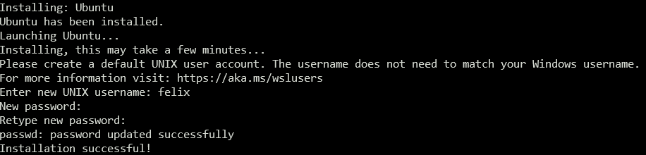
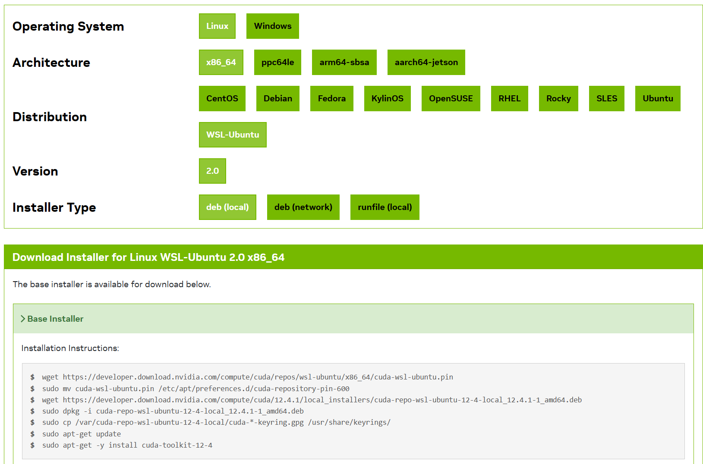
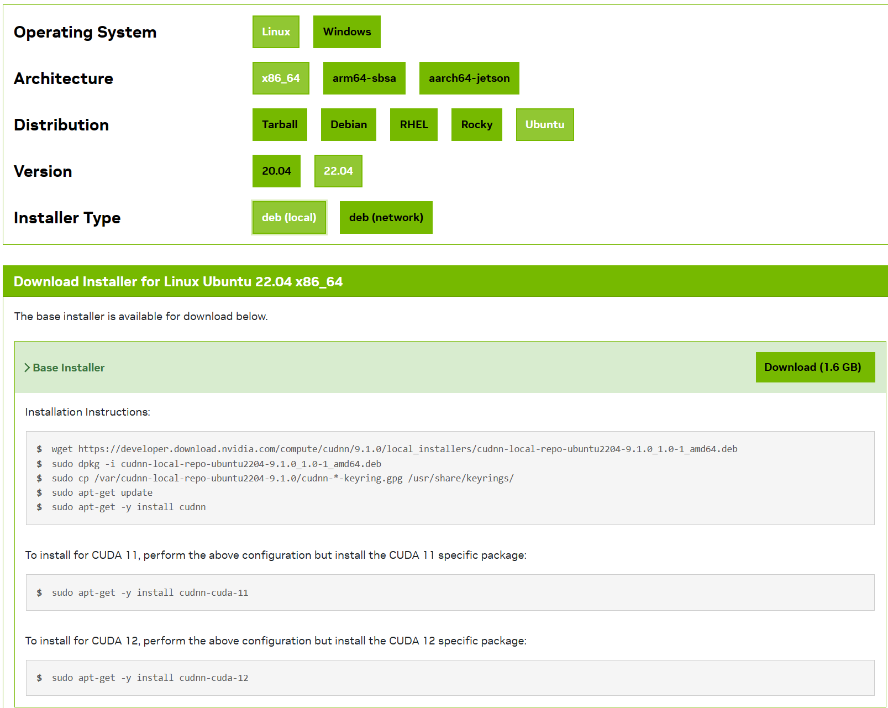

**Windows Subsystem for Linux (WSL)** is a compatibility layer provided by Microsoft that allows you to run a **Linux environment** directly on **WIndows**. It will bring Linux applications, utilities and Bash command-line tool directly on **Windows** without the overhead of traditional virtual machine or dualboot setup.

## 1. Prequisites

The **Windows** must be upgraded to **Windows 10 version 2004 and higher** or **Windows 11** to install **WSL** by a single command line. Open Command Prompt in **Administrator** mode, then run the following command:

```cmd {.command}
wsl --install --no-distribution
```

The command will setup **WSL version 2** by default without any Linux distribution. Reboot the machine to apply changes.

Open a Command Prompt window and install latest version Ubuntu distro:

```cmd {.command}
wsl --install -d Ubuntu
```

The installation takes a few minutes and you need to create **user name** and **password**.



{}
If you want to install another Linux distro, you can run following command to display a list of available WSL Linux distros:

```cmd {.command}
wsl --list --online
```
{}

For the first start, we should to install several Linux updates. The process will depend on the speed of the internet, so be patient if it slow!

```bash {.command}
sudo apt update -y && sudo apt upgrade -y
```

{}
If your machine has integrated **NVIDIA** GPU, you may meet the `/usr/lib/wsl/lib/libcuda.so.1 is not a symbolic link` issue when updating the system.

In the WSL Ubuntu side, run following commands:

```bash {.command}
cd /usr/lib/wsl/lib
sudo rm libcuda.so
sudo rm libcuda.so.1
sudo ln -s libcuda.so.1.1 libcuda.so
sudo ln -s libcuda.so.1.1 libcuda.so.1
```

Now reinstall `libc-bin` package.

```bash {.command}
sudo apt reinstall libc-bin
```

In the Windows side, run following comands in **Administrator** mode:
```cmd {.command}
cd C:\Windows\System32\lxss\lib
del libcuda.so
del libcuda.so.1
mklink libcuda.so libcuda.so.1.1
mklink libcuda.so.1 libcuda.so.1.1
```

Reboot the machine and run the `sudo ldconfig` command in WSL Ubuntu side to verify the problem is solved.
{}

## 2. Installing Mamba

[**Mamba**](https://mamba.readthedocs.io/en/latest/user_guide/mamba.html) is a command-line interfacer (CLI) to manage `conda`'s environemts. For `mamba` configuration, please refer to [**conda documentation**](https://conda.io/projects/conda/en/latest/user-guide/configuration/index.html).

For the fresh installation, you can install [**Miniforge distribution**](https://github.com/conda-forge/miniforge) >= `Miniforge3-22.3.1.0`. **Miniforge** comes with the popular `conda-forge` channel preconfigured, but you can modify the configuration to use any channel you like.

For Unix-like platforms (MAC OS and Linux), download the installer using curl or wget or your favorite program and run the script

```bash {.command}
curl -L -O "https://github.com/conda-forge/miniforge/releases/latest/download/Miniforge3-$(uname)-$(uname -m).sh"
bash Miniforge3-$(uname)-$(uname -m).sh
```

After successful installation, you can use use the mamba commands as described in this [**user guide**](https://mamba.readthedocs.io/en/latest/user_guide/mamba.html#mamba).

{}
The command using `mamba` is similar to the `conda` command.

- Create new environment

```bash {.command}
mamba create -n &lt;ENV_NAME&gt; python=&lt;VERSION&gt;
```

- Activate an environment

```bash (.command)
mamba activate &lt;ENV_NAME&gt;
```

- Deactivate environment

```bash {.command}
mamba deactivate
```

- Delete an environment

```bash {.command}
mamba env remove -n &lt;ENV_NAME&gt;
```

- Show all created environments

```bash {.command}
mamba env list
```

**Remember to activate an environment first, do not install any packages in your base environment!**

- Install python packages

```bash {.command}
mamba install &lt;PKG_NAME&gt;[=VERSION] [-c &lt;CHANNEL_NAME&gt;]
```

When installing a package, you can optionally indicate specific additional channel that the packages are posted by community. The `conda-forge` is one of most common additional channels.

- Delete packages

```bash {.command}
mamba remove &lt;PKG_NAME&gt;
```

- Show all installed packages in the virtual environment

```bash {.command}
mamba list [-n &lt;ENV_NAME&gt;]
```
{}

## 2. Installing NVIDIA CUDA Toolkit for WSL 2

Note that you **only need to install NVIDIA Driver for Windows. Do not install any Linux Driver in WSL**.

The latest NVIDIA Windows GPU Driver will fully support WSL 2. With CUDA support in the driver, existing applications compiled on a Linux system for the same target GPU can run unmodified within the WSL environment. Once NVIDIA Windows GPU Driver is installed in the system, the CUDA driver will be stubbed inside the WSL 2 as `libcuda.so`. Therefore, you only use a separate CUDA Toolkit for WSL 2 which does not contain the NVIDIA Linux GPU Driver.

To get started with running CUDA on **WSL 2**, you need to instal NVIDIA Driver on Windows 11 with a compatible GeForce or NVIDIA RTX/Quadro card from [**here**](https://www.nvidia.com/Download/index.aspx). Once a **Windows NVIDIA GPU driver** is installed on the system, CUDA becomes available within **WSL 2**. The **CUDA driver** installed on **Windows host** will be stubbed inside the WSL 2 as `libcuda.so`.

However, the **NVIDIA CUDA Toolkit for WSL** need to be install for further use.

First, remove the old GPG key:

```bash {.command}
sudo apt-key del 7fa2af80
```

Install the **NVIDIA CUDA Toolkit for WSL-Ubuntu** by following the step in [**this link**](https://developer.nvidia.com/cuda-downloads?target_os=Linux&target_arch=x86_64&Distribution=WSL-Ubuntu&target_version=2.0&target_type=deb_local)

Download [CUDA Toolkit for WSL 2](https://developer.nvidia.com/cuda-downloads?target_os=Linux&target_arch=x86_64&Distribution=WSL-Ubuntu&target_version=2.0&target_type=deb_local).



Some actions must be taken after the installation before the CUDA Toolkit and Driver can be used. The `PATH` and `LD_LIBRARY_PATH` variables need to be updated.

Open `~/.bashrc` by running `nano ~/.bashrc`, add two lines at the end of the file:

```bash
export PATH=/usr/local/cuda-12.4/bin${PATH:+:${PATH}}
export LD_LIBRARY_PATH=/usr/local/cuda-12.4/lib64${LD_LIBRARY_PATH:+:${LD_LIBRARY_PATH}}
```

Then you run `source ~/.bashrc` for activation changes without reboot.

{}
You can verify the installation by running the following command:

```bash {.command}
nvcc --version
```

If the installation was successful, you should see the CUDA version information displayed.

```bash
nvcc: NVIDIA (R) Cuda compiler driver
Copyright (c) 2005-2024 NVIDIA Corporation
Built on Thu_Mar_28_02:18:24_PDT_2024
Cuda compilation tools, release 12.4, V12.4.131
Build cuda_12.4.r12.4/compiler.34097967_0
```

It is important to verify that the **NVIDIA CUDA Toolkit** can find and communicate correctly with CUDA-compatible hardware. To do this, you need to compile and run some sample programs.

CUDA samples are located in [**https://github.com/nvidia/cuda-samples**](https://github.com/nvidia/cuda-samples). To use the samples, clone the project, build the samples in `cuda-samples` directory using `make` command and run them following the instruction on the Github page.

To verify a correct configuration of the hardware and software, it is highly recommended that you build and run the `deviceQuery` sample program.

```bash {.command}
./deviceQuery
```

If  CUDA is installed and configured correctly, the output should look similar as below:

```bash
./deviceQuery Starting...

 CUDA Device Query (Runtime API) version (CUDART static linking)

Detected 1 CUDA Capable device(s)

Device 0: "NVIDIA GeForce RTX 3070 Ti Laptop GPU"
  CUDA Driver Version / Runtime Version          12.4 / 12.4
  CUDA Capability Major/Minor version number:    8.6
  Total amount of global memory:                 8192 MBytes (8589410304 bytes)
  (046) Multiprocessors, (128) CUDA Cores/MP:    5888 CUDA Cores
  GPU Max Clock rate:                            1410 MHz (1.41 GHz)
  Memory Clock rate:                             7001 Mhz
  Memory Bus Width:                              256-bit
  L2 Cache Size:                                 4194304 bytes
  Maximum Texture Dimension Size (x,y,z)         1D=(131072), 2D=(131072, 65536), 3D=(16384, 16384, 16384)
  Maximum Layered 1D Texture Size, (num) layers  1D=(32768), 2048 layers
  Maximum Layered 2D Texture Size, (num) layers  2D=(32768, 32768), 2048 layers
  Total amount of constant memory:               65536 bytes
  Total amount of shared memory per block:       49152 bytes
  Total shared memory per multiprocessor:        102400 bytes
  Total number of registers available per block: 65536
  Warp size:                                     32
  Maximum number of threads per multiprocessor:  1536
  Maximum number of threads per block:           1024
  Max dimension size of a thread block (x,y,z): (1024, 1024, 64)
  Max dimension size of a grid size    (x,y,z): (2147483647, 65535, 65535)
  Maximum memory pitch:                          2147483647 bytes
  Texture alignment:                             512 bytes
  Concurrent copy and kernel execution:          Yes with 1 copy engine(s)
  Run time limit on kernels:                     Yes
  Integrated GPU sharing Host Memory:            No
  Support host page-locked memory mapping:       Yes
  Alignment requirement for Surfaces:            Yes
  Device has ECC support:                        Disabled
  Device supports Unified Addressing (UVA):      Yes
  Device supports Managed Memory:                Yes
  Device supports Compute Preemption:            Yes
  Supports Cooperative Kernel Launch:            Yes
  Supports MultiDevice Co-op Kernel Launch:      No
  Device PCI Domain ID / Bus ID / location ID:   0 / 1 / 0
  Compute Mode:
     < Default (multiple host threads can use ::cudaSetDevice() with device simultaneously) >

deviceQuery, CUDA Driver = CUDART, CUDA Driver Version = 12.4, CUDA Runtime Version = 12.4, NumDevs = 1
Result = PASS
```

By running the `bandwidthTest` program, you can ensure that the system and CUDA-capable device are able to communicate correctly. 

```bash {.command}
./bandwidthText
```

The output shoud be here.

```bash
[CUDA Bandwidth Test] - Starting...
Running on...

 Device 0: NVIDIA GeForce RTX 3070 Ti Laptop GPU
 Quick Mode

 Host to Device Bandwidth, 1 Device(s)
 PINNED Memory Transfers
   Transfer Size (Bytes)        Bandwidth(GB/s)
   32000000                     24.5

 Device to Host Bandwidth, 1 Device(s)
 PINNED Memory Transfers
   Transfer Size (Bytes)        Bandwidth(GB/s)
   32000000                     26.3

 Device to Device Bandwidth, 1 Device(s)
 PINNED Memory Transfers
   Transfer Size (Bytes)        Bandwidth(GB/s)
   32000000                     323.6

Result = PASS

NOTE: The CUDA Samples are not meant for performance measurements. Results may vary when GPU Boost is enabled.
```

For CUDA graphic programs, **WSL 2** currently does not support **GL**, **Vulcan**. Hence, you cannot run CUDA graphic programs.
{}

## 2. Installing NVIDIA CuDNN for WSL 2

Since **cuDNN version 9** can exist independently with previous version **cuDNN**, you can refer [**here**](https://developer.nvidia.com/cudnn-downloads?target_os=Linux&target_arch=x86_64&Distribution=Ubuntu&target_version=22.04&target_type=deb_local) and follow the steps for your target platform.



{}
To verify **cuDNN** is install and is running properly, you can download and compile **cuDNN** samples. These samples can be downloaded by running:

```bash {.command}
sudo apt install -y libcudnn9-samples
```

The samples is located in **/usr/src/cudnn_samples_v9** directory, copy the directory to `$HOME` and set the permission.

```bash {.command}
sudo cp -r cudnn_samples_v9/ $HOME
sudo chmod -R a+rwx $HOME/cudnn_samples_v9
```

For the `mnistCUDNN` sample, install `FreeImage` package and compile the sample.

```bash {.command}
sudo apt install -y libfreeimage3 libfreeimage-dev
cd $HOME/cudnn_samples_v9/mnistCUDNN
make clean && make
./mnistCUDNN
```

The result should be as:

```bash
Executing: mnistCUDNN
cudnnGetVersion() : 90100 , CUDNN_VERSION from cudnn.h : 90100 (9.1.0)
Host compiler version : GCC 11.4.0

There are 1 CUDA capable devices on your machine :
device 0 : sms 46  Capabilities 8.6, SmClock 1410.0 Mhz, MemSize (Mb) 8191, MemClock 7001.0 Mhz, Ecc=0, boardGroupID=0
Using device 0

Testing single precision
Loading binary file data/conv1.bin
Loading binary file data/conv1.bias.bin
Loading binary file data/conv2.bin
Loading binary file data/conv2.bias.bin
Loading binary file data/ip1.bin
Loading binary file data/ip1.bias.bin
Loading binary file data/ip2.bin
Loading binary file data/ip2.bias.bin
Loading image data/one_28x28.pgm
Performing forward propagation ...
Testing cudnnGetConvolutionForwardAlgorithm_v7 ...
^^^^ CUDNN_STATUS_SUCCESS for Algo 1: -1.000000 time requiring 0 memory
^^^^ CUDNN_STATUS_SUCCESS for Algo 0: -1.000000 time requiring 0 memory
^^^^ CUDNN_STATUS_SUCCESS for Algo 2: -1.000000 time requiring 0 memory
^^^^ CUDNN_STATUS_SUCCESS for Algo 5: -1.000000 time requiring 178432 memory
^^^^ CUDNN_STATUS_SUCCESS for Algo 4: -1.000000 time requiring 184784 memory
^^^^ CUDNN_STATUS_SUCCESS for Algo 7: -1.000000 time requiring 2057744 memory
^^^^ CUDNN_STATUS_NOT_SUPPORTED for Algo 6: -1.000000 time requiring 0 memory
^^^^ CUDNN_STATUS_NOT_SUPPORTED for Algo 3: -1.000000 time requiring 0 memory
Testing cudnnFindConvolutionForwardAlgorithm ...
^^^^ CUDNN_STATUS_SUCCESS for Algo 0: 0.009216 time requiring 0 memory
^^^^ CUDNN_STATUS_SUCCESS for Algo 1: 0.009216 time requiring 0 memory
^^^^ CUDNN_STATUS_SUCCESS for Algo 5: 0.096256 time requiring 178432 memory
^^^^ CUDNN_STATUS_SUCCESS for Algo 7: 0.115712 time requiring 2057744 memory
^^^^ CUDNN_STATUS_SUCCESS for Algo 4: 0.168960 time requiring 184784 memory
^^^^ CUDNN_STATUS_SUCCESS for Algo 2: 0.546016 time requiring 0 memory
^^^^ CUDNN_STATUS_NOT_SUPPORTED for Algo 6: -1.000000 time requiring 0 memory
^^^^ CUDNN_STATUS_NOT_SUPPORTED for Algo 3: -1.000000 time requiring 0 memory
Testing cudnnGetConvolutionForwardAlgorithm_v7 ...
^^^^ CUDNN_STATUS_SUCCESS for Algo 1: -1.000000 time requiring 0 memory
^^^^ CUDNN_STATUS_SUCCESS for Algo 0: -1.000000 time requiring 0 memory
^^^^ CUDNN_STATUS_SUCCESS for Algo 2: -1.000000 time requiring 0 memory
^^^^ CUDNN_STATUS_SUCCESS for Algo 4: -1.000000 time requiring 2450080 memory
^^^^ CUDNN_STATUS_SUCCESS for Algo 5: -1.000000 time requiring 4656640 memory
^^^^ CUDNN_STATUS_SUCCESS for Algo 7: -1.000000 time requiring 1433120 memory
^^^^ CUDNN_STATUS_NOT_SUPPORTED for Algo 6: -1.000000 time requiring 0 memory
^^^^ CUDNN_STATUS_NOT_SUPPORTED for Algo 3: -1.000000 time requiring 0 memory
Testing cudnnFindConvolutionForwardAlgorithm ...
^^^^ CUDNN_STATUS_SUCCESS for Algo 0: 0.035840 time requiring 0 memory
^^^^ CUDNN_STATUS_SUCCESS for Algo 1: 0.058368 time requiring 0 memory
^^^^ CUDNN_STATUS_SUCCESS for Algo 2: 0.066560 time requiring 0 memory
^^^^ CUDNN_STATUS_SUCCESS for Algo 7: 0.093184 time requiring 1433120 memory
^^^^ CUDNN_STATUS_SUCCESS for Algo 5: 0.109600 time requiring 4656640 memory
^^^^ CUDNN_STATUS_SUCCESS for Algo 4: 0.192512 time requiring 2450080 memory
^^^^ CUDNN_STATUS_NOT_SUPPORTED for Algo 6: -1.000000 time requiring 0 memory
^^^^ CUDNN_STATUS_NOT_SUPPORTED for Algo 3: -1.000000 time requiring 0 memory
Resulting weights from Softmax:
0.0000000 0.9999399 0.0000000 0.0000000 0.0000561 0.0000000 0.0000012 0.0000017 0.0000010 0.0000000
Loading image data/three_28x28.pgm
Performing forward propagation ...
Testing cudnnGetConvolutionForwardAlgorithm_v7 ...
^^^^ CUDNN_STATUS_SUCCESS for Algo 1: -1.000000 time requiring 0 memory
^^^^ CUDNN_STATUS_SUCCESS for Algo 0: -1.000000 time requiring 0 memory
^^^^ CUDNN_STATUS_SUCCESS for Algo 2: -1.000000 time requiring 0 memory
^^^^ CUDNN_STATUS_SUCCESS for Algo 5: -1.000000 time requiring 178432 memory
^^^^ CUDNN_STATUS_SUCCESS for Algo 4: -1.000000 time requiring 184784 memory
^^^^ CUDNN_STATUS_SUCCESS for Algo 7: -1.000000 time requiring 2057744 memory
^^^^ CUDNN_STATUS_NOT_SUPPORTED for Algo 6: -1.000000 time requiring 0 memory
^^^^ CUDNN_STATUS_NOT_SUPPORTED for Algo 3: -1.000000 time requiring 0 memory
Testing cudnnFindConvolutionForwardAlgorithm ...
^^^^ CUDNN_STATUS_SUCCESS for Algo 1: 0.008192 time requiring 0 memory
^^^^ CUDNN_STATUS_SUCCESS for Algo 2: 0.009216 time requiring 0 memory
^^^^ CUDNN_STATUS_SUCCESS for Algo 0: 0.026624 time requiring 0 memory
^^^^ CUDNN_STATUS_SUCCESS for Algo 7: 0.061248 time requiring 2057744 memory
^^^^ CUDNN_STATUS_SUCCESS for Algo 4: 0.073728 time requiring 184784 memory
^^^^ CUDNN_STATUS_SUCCESS for Algo 5: 0.106496 time requiring 178432 memory
^^^^ CUDNN_STATUS_NOT_SUPPORTED for Algo 6: -1.000000 time requiring 0 memory
^^^^ CUDNN_STATUS_NOT_SUPPORTED for Algo 3: -1.000000 time requiring 0 memory
Testing cudnnGetConvolutionForwardAlgorithm_v7 ...
^^^^ CUDNN_STATUS_SUCCESS for Algo 1: -1.000000 time requiring 0 memory
^^^^ CUDNN_STATUS_SUCCESS for Algo 0: -1.000000 time requiring 0 memory
^^^^ CUDNN_STATUS_SUCCESS for Algo 2: -1.000000 time requiring 0 memory
^^^^ CUDNN_STATUS_SUCCESS for Algo 4: -1.000000 time requiring 2450080 memory
^^^^ CUDNN_STATUS_SUCCESS for Algo 5: -1.000000 time requiring 4656640 memory
^^^^ CUDNN_STATUS_SUCCESS for Algo 7: -1.000000 time requiring 1433120 memory
^^^^ CUDNN_STATUS_NOT_SUPPORTED for Algo 6: -1.000000 time requiring 0 memory
^^^^ CUDNN_STATUS_NOT_SUPPORTED for Algo 3: -1.000000 time requiring 0 memory
Testing cudnnFindConvolutionForwardAlgorithm ...
^^^^ CUDNN_STATUS_SUCCESS for Algo 0: 0.031520 time requiring 0 memory
^^^^ CUDNN_STATUS_SUCCESS for Algo 1: 0.038912 time requiring 0 memory
^^^^ CUDNN_STATUS_SUCCESS for Algo 2: 0.066400 time requiring 0 memory
^^^^ CUDNN_STATUS_SUCCESS for Algo 7: 0.091136 time requiring 1433120 memory
^^^^ CUDNN_STATUS_SUCCESS for Algo 5: 0.129024 time requiring 4656640 memory
^^^^ CUDNN_STATUS_SUCCESS for Algo 4: 0.145408 time requiring 2450080 memory
^^^^ CUDNN_STATUS_NOT_SUPPORTED for Algo 6: -1.000000 time requiring 0 memory
^^^^ CUDNN_STATUS_NOT_SUPPORTED for Algo 3: -1.000000 time requiring 0 memory
Resulting weights from Softmax:
0.0000000 0.0000000 0.0000000 0.9999288 0.0000000 0.0000711 0.0000000 0.0000000 0.0000000 0.0000000
Loading image data/five_28x28.pgm
Performing forward propagation ...
Resulting weights from Softmax:
0.0000000 0.0000008 0.0000000 0.0000002 0.0000000 0.9999820 0.0000154 0.0000000 0.0000012 0.0000006

Result of classification: 1 3 5

Test passed!

Testing half precision (math in single precision)
Loading binary file data/conv1.bin
Loading binary file data/conv1.bias.bin
Loading binary file data/conv2.bin
Loading binary file data/conv2.bias.bin
Loading binary file data/ip1.bin
Loading binary file data/ip1.bias.bin
Loading binary file data/ip2.bin
Loading binary file data/ip2.bias.bin
Loading image data/one_28x28.pgm
Performing forward propagation ...
Testing cudnnGetConvolutionForwardAlgorithm_v7 ...
^^^^ CUDNN_STATUS_SUCCESS for Algo 1: -1.000000 time requiring 0 memory
^^^^ CUDNN_STATUS_SUCCESS for Algo 0: -1.000000 time requiring 0 memory
^^^^ CUDNN_STATUS_SUCCESS for Algo 2: -1.000000 time requiring 0 memory
^^^^ CUDNN_STATUS_SUCCESS for Algo 5: -1.000000 time requiring 178432 memory
^^^^ CUDNN_STATUS_SUCCESS for Algo 4: -1.000000 time requiring 184784 memory
^^^^ CUDNN_STATUS_SUCCESS for Algo 7: -1.000000 time requiring 2057744 memory
^^^^ CUDNN_STATUS_NOT_SUPPORTED for Algo 6: -1.000000 time requiring 0 memory
^^^^ CUDNN_STATUS_NOT_SUPPORTED for Algo 3: -1.000000 time requiring 0 memory
Testing cudnnFindConvolutionForwardAlgorithm ...
^^^^ CUDNN_STATUS_SUCCESS for Algo 2: 0.009216 time requiring 0 memory
^^^^ CUDNN_STATUS_SUCCESS for Algo 0: 0.010240 time requiring 0 memory
^^^^ CUDNN_STATUS_SUCCESS for Algo 1: 0.017408 time requiring 0 memory
^^^^ CUDNN_STATUS_SUCCESS for Algo 7: 0.068512 time requiring 2057744 memory
^^^^ CUDNN_STATUS_SUCCESS for Algo 5: 0.070784 time requiring 178432 memory
^^^^ CUDNN_STATUS_SUCCESS for Algo 4: 0.103424 time requiring 184784 memory
^^^^ CUDNN_STATUS_NOT_SUPPORTED for Algo 6: -1.000000 time requiring 0 memory
^^^^ CUDNN_STATUS_NOT_SUPPORTED for Algo 3: -1.000000 time requiring 0 memory
Testing cudnnGetConvolutionForwardAlgorithm_v7 ...
^^^^ CUDNN_STATUS_SUCCESS for Algo 7: -1.000000 time requiring 1433120 memory
^^^^ CUDNN_STATUS_SUCCESS for Algo 1: -1.000000 time requiring 1536 memory
^^^^ CUDNN_STATUS_SUCCESS for Algo 0: -1.000000 time requiring 0 memory
^^^^ CUDNN_STATUS_SUCCESS for Algo 2: -1.000000 time requiring 64000 memory
^^^^ CUDNN_STATUS_SUCCESS for Algo 5: -1.000000 time requiring 4656640 memory
^^^^ CUDNN_STATUS_SUCCESS for Algo 4: -1.000000 time requiring 2450080 memory
^^^^ CUDNN_STATUS_NOT_SUPPORTED for Algo 6: -1.000000 time requiring 0 memory
^^^^ CUDNN_STATUS_NOT_SUPPORTED for Algo 3: -1.000000 time requiring 0 memory
Testing cudnnFindConvolutionForwardAlgorithm ...
^^^^ CUDNN_STATUS_SUCCESS for Algo 0: 0.079872 time requiring 0 memory
^^^^ CUDNN_STATUS_SUCCESS for Algo 1: 0.079872 time requiring 1536 memory
^^^^ CUDNN_STATUS_SUCCESS for Algo 2: 0.101376 time requiring 64000 memory
^^^^ CUDNN_STATUS_SUCCESS for Algo 5: 0.101440 time requiring 4656640 memory
^^^^ CUDNN_STATUS_SUCCESS for Algo 4: 0.105472 time requiring 2450080 memory
^^^^ CUDNN_STATUS_SUCCESS for Algo 7: 0.126976 time requiring 1433120 memory
^^^^ CUDNN_STATUS_NOT_SUPPORTED for Algo 6: -1.000000 time requiring 0 memory
^^^^ CUDNN_STATUS_NOT_SUPPORTED for Algo 3: -1.000000 time requiring 0 memory
Resulting weights from Softmax:
0.0000001 1.0000000 0.0000001 0.0000000 0.0000563 0.0000001 0.0000012 0.0000017 0.0000010 0.0000001
Loading image data/three_28x28.pgm
Performing forward propagation ...
Testing cudnnGetConvolutionForwardAlgorithm_v7 ...
^^^^ CUDNN_STATUS_SUCCESS for Algo 1: -1.000000 time requiring 0 memory
^^^^ CUDNN_STATUS_SUCCESS for Algo 0: -1.000000 time requiring 0 memory
^^^^ CUDNN_STATUS_SUCCESS for Algo 2: -1.000000 time requiring 0 memory
^^^^ CUDNN_STATUS_SUCCESS for Algo 5: -1.000000 time requiring 178432 memory
^^^^ CUDNN_STATUS_SUCCESS for Algo 4: -1.000000 time requiring 184784 memory
^^^^ CUDNN_STATUS_SUCCESS for Algo 7: -1.000000 time requiring 2057744 memory
^^^^ CUDNN_STATUS_NOT_SUPPORTED for Algo 6: -1.000000 time requiring 0 memory
^^^^ CUDNN_STATUS_NOT_SUPPORTED for Algo 3: -1.000000 time requiring 0 memory
Testing cudnnFindConvolutionForwardAlgorithm ...
^^^^ CUDNN_STATUS_SUCCESS for Algo 2: 0.010240 time requiring 0 memory
^^^^ CUDNN_STATUS_SUCCESS for Algo 0: 0.023552 time requiring 0 memory
^^^^ CUDNN_STATUS_SUCCESS for Algo 1: 0.064480 time requiring 0 memory
^^^^ CUDNN_STATUS_SUCCESS for Algo 7: 0.087008 time requiring 2057744 memory
^^^^ CUDNN_STATUS_SUCCESS for Algo 4: 0.103424 time requiring 184784 memory
^^^^ CUDNN_STATUS_SUCCESS for Algo 5: 0.138144 time requiring 178432 memory
^^^^ CUDNN_STATUS_NOT_SUPPORTED for Algo 6: -1.000000 time requiring 0 memory
^^^^ CUDNN_STATUS_NOT_SUPPORTED for Algo 3: -1.000000 time requiring 0 memory
Testing cudnnGetConvolutionForwardAlgorithm_v7 ...
^^^^ CUDNN_STATUS_SUCCESS for Algo 7: -1.000000 time requiring 1433120 memory
^^^^ CUDNN_STATUS_SUCCESS for Algo 1: -1.000000 time requiring 1536 memory
^^^^ CUDNN_STATUS_SUCCESS for Algo 0: -1.000000 time requiring 0 memory
^^^^ CUDNN_STATUS_SUCCESS for Algo 2: -1.000000 time requiring 64000 memory
^^^^ CUDNN_STATUS_SUCCESS for Algo 5: -1.000000 time requiring 4656640 memory
^^^^ CUDNN_STATUS_SUCCESS for Algo 4: -1.000000 time requiring 2450080 memory
^^^^ CUDNN_STATUS_NOT_SUPPORTED for Algo 6: -1.000000 time requiring 0 memory
^^^^ CUDNN_STATUS_NOT_SUPPORTED for Algo 3: -1.000000 time requiring 0 memory
Testing cudnnFindConvolutionForwardAlgorithm ...
^^^^ CUDNN_STATUS_SUCCESS for Algo 0: 0.083904 time requiring 0 memory
^^^^ CUDNN_STATUS_SUCCESS for Algo 7: 0.090112 time requiring 1433120 memory
^^^^ CUDNN_STATUS_SUCCESS for Algo 5: 0.094976 time requiring 4656640 memory
^^^^ CUDNN_STATUS_SUCCESS for Algo 4: 0.095232 time requiring 2450080 memory
^^^^ CUDNN_STATUS_SUCCESS for Algo 2: 0.111616 time requiring 64000 memory
^^^^ CUDNN_STATUS_SUCCESS for Algo 1: 0.186368 time requiring 1536 memory
^^^^ CUDNN_STATUS_NOT_SUPPORTED for Algo 6: -1.000000 time requiring 0 memory
^^^^ CUDNN_STATUS_NOT_SUPPORTED for Algo 3: -1.000000 time requiring 0 memory
Resulting weights from Softmax:
0.0000000 0.0000000 0.0000000 1.0000000 0.0000000 0.0000714 0.0000000 0.0000000 0.0000000 0.0000000
Loading image data/five_28x28.pgm
Performing forward propagation ...
Resulting weights from Softmax:
0.0000000 0.0000008 0.0000000 0.0000002 0.0000000 1.0000000 0.0000154 0.0000000 0.0000012 0.0000006

Result of classification: 1 3 5

Test passed!
```
{}

## 3. Installing NVIDIA TensorRT (Optional)

**NVIDIA TensorRT** is a C++ library that facilitates high-performance inference NVIDIA graphic processing units (GPUs). **TensorRT** takes a trained network, which consists of a network definition and a set of trained parameters, and produces a highly optimized runtime engine that performs inference for that network.

**TensorRT** provides APIs via C++ and Python that help to express deep learning model via the Network Definition API or load a pre-defined model via the ONNX parser that allow **TensorRT** to optimize and run them on the NVIDIA GPU. **TensorRT** also include optional high speed mixed precision capabilities with difference NVIDIA architectures.

You can download **TensorRT** local repo that matches the Ubuntu version and CPU architecture of your machine from [**here**](https://developer.nvidia.com/tensorrt/download/10x).

Install the Debian local package.

```bash {.command}
os="ubuntuxx04"
tag="10.x.x-cuda-x.x"
sudo dpkg -i nv-tensorrt-local-repo-${os}-${tag}_1.0-1_amd64.deb
sudo cp /var/nv-tensorrt-local-repo-${os}-${tag}/*-keyring.gpg /usr/share/keyrings/
sudo apt-get update
```

Replace `ubuntuxx04`, `10.x.x` and `cuda-x.x` with your specific OS version, TensorRT version, and CUDA version. The full **TensorRT** C++ and Python runtimes can be installed by:

```bash {.command}
sudo apt install -y tensorrt
```

{}
To verify the installation, run the command:

```bash {.command}
dpkg-query -W tensorrt
```

The ouput should be as following:

```bash
tensorrt        10.0.0.6-1+cuda12.4
```

The samples is located in **/usr/src/tensorrt** directory, copy the directory to `$HOME` and set the permission.

```bash {.command}
sudo cp -r tensorrt/ $HOME
sudo chmod -R a+rwx $HOME/tensorrt
```

For the `sampleOnnxMNIST` sample, compile the sample and run the program.

```bash {.command}
cd $HOME/tensorrt/samples/sampleOnnxMNIST
make clean && make
cd ../../bin
./sampleOnnxMNIST
```

The output should be as following:

```bash
&&&& RUNNING TensorRT.sample_onnx_mnist [TensorRT v100000] # ./sample_onnx_mnist
[04/15/2024-18:24:17] [I] Building and running a GPU inference engine for Onnx MNIST
[04/15/2024-18:24:17] [I] [TRT] [MemUsageChange] Init CUDA: CPU +19, GPU +0, now: CPU 21, GPU 1091 (MiB)
[04/15/2024-18:24:19] [I] [TRT] [MemUsageChange] Init builder kernel library: CPU +1765, GPU +312, now: CPU 1922, GPU 1403 (MiB)
[04/15/2024-18:24:19] [I] [TRT] ----------------------------------------------------------------
[04/15/2024-18:24:19] [I] [TRT] Input filename:   ../data/mnist/mnist.onnx
[04/15/2024-18:24:19] [I] [TRT] ONNX IR version:  0.0.3
[04/15/2024-18:24:19] [I] [TRT] Opset version:    8
[04/15/2024-18:24:19] [I] [TRT] Producer name:    CNTK
[04/15/2024-18:24:19] [I] [TRT] Producer version: 2.5.1
[04/15/2024-18:24:19] [I] [TRT] Domain:           ai.cntk
[04/15/2024-18:24:19] [I] [TRT] Model version:    1
[04/15/2024-18:24:19] [I] [TRT] Doc string:
[04/15/2024-18:24:19] [I] [TRT] ----------------------------------------------------------------
[04/15/2024-18:24:19] [I] [TRT] Local timing cache in use. Profiling results in this builder pass will not be stored.
[04/15/2024-18:24:21] [I] [TRT] Detected 1 inputs and 1 output network tensors.
[04/15/2024-18:24:21] [I] [TRT] Total Host Persistent Memory: 26272
[04/15/2024-18:24:21] [I] [TRT] Total Device Persistent Memory: 0
[04/15/2024-18:24:21] [I] [TRT] Total Scratch Memory: 0
[04/15/2024-18:24:21] [I] [TRT] [BlockAssignment] Started assigning block shifts. This will take 6 steps to complete.
[04/15/2024-18:24:21] [I] [TRT] [BlockAssignment] Algorithm ShiftNTopDown took 0.02021ms to assign 3 blocks to 6 nodes requiring 32256 bytes.
[04/15/2024-18:24:21] [I] [TRT] Total Activation Memory: 31744
[04/15/2024-18:24:21] [I] [TRT] Total Weights Memory: 26152
[04/15/2024-18:24:21] [I] [TRT] Engine generation completed in 1.46118 seconds.
[04/15/2024-18:24:21] [I] [TRT] [MemUsageStats] Peak memory usage of TRT CPU/GPU memory allocators: CPU 0 MiB, GPU 5 MiB
[04/15/2024-18:24:21] [I] [TRT] [MemUsageStats] Peak memory usage during Engine building and serialization: CPU: 3052 MiB
[04/15/2024-18:24:21] [I] [TRT] Loaded engine size: 0 MiB
[04/15/2024-18:24:21] [I] [TRT] [MemUsageChange] TensorRT-managed allocation in IExecutionContext creation: CPU +0, GPU +0, now: CPU 0, GPU 0 (MiB)
[04/15/2024-18:24:21] [I] Input:
[04/15/2024-18:24:21] [I] @@@@@@@@@@@@@@@@@@@@@@@@@@@@
@@@@@@@@@@@@@@@@@@@@@@@@@@@@
@@@@@@@@@@@@@@@@@@@@@@@@@@@@
@@@@@@@@@@@@@@@@@@@@@@@@@@@@
@@@@@@@@@@@@@@@@@@@@@@@@@@@@
@@@@@@@@@@@@@@@@@@@@@@@@@@@@
@@@@@@@%=#@@@@@%=%@@@@@@@@@@
@@@@@@@           %@@@@@@@@@
@@@@@@@           %@@@@@@@@@
@@@@@@@#:-#-.     %@@@@@@@@@
@@@@@@@@@@@@#    #@@@@@@@@@@
@@@@@@@@@@@@@    #@@@@@@@@@@
@@@@@@@@@@@@@:  :@@@@@@@@@@@
@@@@@@@@@%+==   *%%%%%%%%%@@
@@@@@@@@%                 -@
@@@@@@@@@#+.          .:-%@@
@@@@@@@@@@@*     :-###@@@@@@
@@@@@@@@@@@*   -%@@@@@@@@@@@
@@@@@@@@@@@*   *@@@@@@@@@@@@
@@@@@@@@@@@*   @@@@@@@@@@@@@
@@@@@@@@@@@*   #@@@@@@@@@@@@
@@@@@@@@@@@*   *@@@@@@@@@@@@
@@@@@@@@@@@*   *@@@@@@@@@@@@
@@@@@@@@@@@*   @@@@@@@@@@@@@
@@@@@@@@@@@*   @@@@@@@@@@@@@
@@@@@@@@@@@@+=#@@@@@@@@@@@@@
@@@@@@@@@@@@@@@@@@@@@@@@@@@@
@@@@@@@@@@@@@@@@@@@@@@@@@@@@

[04/15/2024-18:24:21] [I] Output:
[04/15/2024-18:24:21] [I]  Prob 0  0.0000 Class 0:
[04/15/2024-18:24:21] [I]  Prob 1  0.0000 Class 1:
[04/15/2024-18:24:21] [I]  Prob 2  0.0000 Class 2:
[04/15/2024-18:24:21] [I]  Prob 3  0.0000 Class 3:
[04/15/2024-18:24:21] [I]  Prob 4  0.0000 Class 4:
[04/15/2024-18:24:21] [I]  Prob 5  0.0000 Class 5:
[04/15/2024-18:24:21] [I]  Prob 6  0.0000 Class 6:
[04/15/2024-18:24:21] [I]  Prob 7  1.0000 Class 7: **********
[04/15/2024-18:24:21] [I]  Prob 8  0.0000 Class 8:
[04/15/2024-18:24:21] [I]  Prob 9  0.0000 Class 9:
[04/15/2024-18:24:21] [I]
&&&& PASSED TensorRT.sample_onnx_mnist [TensorRT v100000] # ./sample_onnx_mnist
```
{}

If you are using **TensorRT Python API**, make sure **CUDA-Python** is installed in your system or your virtual environment.

```bash {.command}
mamba create -n tensorrt_env pip wheel
mamba activate tensorrt_env
```

* Installing from **PyPI**, **TensorRT** runtime wheels

```bash {.command}
pip install cuda-python
pip install --pre --upgrade tensorrt
pip install --pre --upgrade tensorrt_lean tensorrt_dispatch
```

To verify the installation is working, use python code.

```python {.command}
import tensorrt
print(tensorrt.__version__)
assert(tensorrt.Builder(tensorrt.Logger()))

import tensorrt_lean as trtl
print(trtl.__version__)
assert trtl.Runtime(trt.Logger())

import tensorrt_dispatch as trtd
print(trtd.__version__)
assert trtd.Runtime(trt.Logger())
```

The `tensorrt/samples` directory also provides the samples that utilize with the **TensorRT**, you can follow instructions from `README.md` to run samples.

## 3. Set up Python environment using Mambaforge

Python environment allows to manage separatelly different installations of Python and modules. It is useful when you have many projects running different version of Python and modules. It also help to manage installed modules for publish or reproduce.

There are different ways to create a python virtual environment, including built-in `venv`, `Conda` and `Anaconda`. 

`Conda` is a packaging tool and installer that aims to handle library dependencies outside of the Python packages as well as the Python packages themselves. For non preinstalled package manager, `Miniconda`, an installation of Conda, will be a good option.

`Anacond`a is an installation of Conda that comes pre-loaded with a bunch of packages for scientific computing, i.e., `numpy`, `matplotlib`, `scipy`, etc. It also comes with IDE, Jupyter notebooks out of the box. This is helpful for beginers, but doesn't give much control.

`Mamba` is a package manager which can be used with Python. Unlike `Conda`, it uses the C/C++ implementation to speed up the package installation. Read more about `mamba` in [here](https://focalplane.biologists.com/2022/12/08/managing-scientific-python-environments-using-conda-mamba-and-friends/). To install `mamba`, access [its repo](https://github.com/conda-forge/miniforge) and pick the Mabaforge installer for your operating system.

Remember to run `conda init` at the end of your installation in your bash to activate the `mamba` command.


## Conclusion

By following these steps and installing the required software, you will have an CUDA-ready environment in WSL for further machine learnin/deep learning applications. This environment will provide the necessary tools and libraries for GPU-accelerated computing and Python package management.

## Reference

- [Install CUDA and CUDNN on Windows & Linux](https://medium.com/geekculture/install-cuda-and-cudnn-on-windows-linux-52d1501a8805).
- [CUDA on WSL User Guide](https://docs.nvidia.com/cuda/wsl-user-guide/index.html).
- [Machine learning environment build: WLS2+Ubuntu+CUDA+cuDNN](https://visualstudio.microsoft.com/free-developer-offers/).
- [Getting started with Mambaforge and Python](https://biapol.github.io/blog/mara_lampert/getting_started_with_mambaforge_and_python/readme.html).
- [Tutorial: Setting up Python enviroments with Mambaforge](https://ross-dobson.github.io/posts/2021/01/setting-up-python-virtual-environments-with-mambaforge/).

