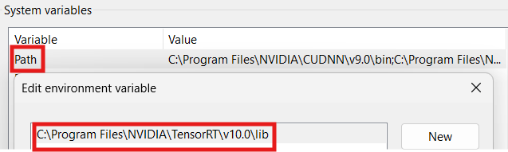

In this post, I will cover how to setup **NVIDIA CUDA** on Windows 11. To ensure a smooth setup process, it is crucial to follow the following steps:

- NVIDIA Drivers.
- Microsoft Visual Studio 2022 Community.
- NVIDIA CUDA Toolkit.
- NVIDIA cuDNN.
- TensorRT (optional).
- Miniforge (optional).

## 1. System Requirements

To use CUDA, make sure your machine has a CUDA-capable GPU inside and the **Microsoft Windows 11** should be updated **21H2** version.

You can verify if your machine has CUDA-supported GPU through **Display Adapters** section in the **Windows Device Manager**. Here you will find the vendor name and model of your GPU.


You also need to install **Microsft Visual Studio 2022 Community** as the native compilter for x86_64 application. The download link os the latest version is [**here**](https://visualstudio.microsoft.com/thank-you-downloading-visual-studio/?sku=Community) and install the **Desktop development with C++** workload.


If there is any NVIDIA CUDA Toolkit installed before, you need to uninstall before proceeding further, following these steps:

1. Open the **Settings > Apps > Installed Apps**.
2. Scroll down and find NVIDIA CUDA applications. 


3. Click to "..." button on the right and uninstall all NVIDIA GPU drivers and any associated software. 


Then you need to install NVIDIA driver to communicate your computer with NVIDIA devices. You can find the suitable driver from this [**website**](https://www.nvidia.com/download/index.aspx?lang=en-us).


After the installation is complete, reboot your system.

## 2. Installing Mamba

[**Mamba**](https://mamba.readthedocs.io/en/latest/user_guide/mamba.html) is a command-line interfacer (CLI) to manage `conda`'s environemts. For `mamba` configuration, please refer to [**conda documentation**](https://conda.io/projects/conda/en/latest/user-guide/configuration/index.html).

For the fresh installation, you can install [**Miniforge distribution**](https://github.com/conda-forge/miniforge) >= `Miniforge3-22.3.1.0`. **Miniforge** comes with the popular `conda-forge` channel preconfigured, but you can modify the configuration to use any channel you like.

{}
Follow the instaltion prompts, taking note of options to **Create start menu shortcuts** and **Add Miniforge3 to my PATH environment variable**.


{}

After successful installation, you can use use the mamba commands as described in this [**user guide**](https://mamba.readthedocs.io/en/latest/user_guide/mamba.html#mamba).

{}
After installation, you make sure that the **Anaconda** is not the default configured channel, seeing [**this**](https://mamba.readthedocs.io/en/latest/user_guide/troubleshooting.html#defaults-channels).

**DO NOT** install anything into the `base` environment as this might break your installation. See [**here**](https://mamba.readthedocs.io/en/latest/user_guide/troubleshooting.html#base-packages) for details.

{}

## 3. Installing NVIDIA CUDA Toolkit

You can visit the [**NVIDIA Developer website for CUDA Toolkit**](https://developer.nvidia.com/cuda-downloads) TO get the latest version of NVIDIA CUDA Toolkit. For previous versions, you can check from the [**Archive of Previous CUDA Releases**](https://developer.nvidia.com/cuda-toolkit-archive) page.

On the dowload page, you choose the appropriate version based on your system. 


Then, you locate the downloaded installer file and double-click on it to start the installation process. Follow the on-screen instructions provided by the installer.


Once the installation is completed, you check environment variables `CUDA_PATH` and `PATH` to ensure that your system recognizes **NVIDIA CUDA Toolkit**.


{}
You can verify the installation by running the following command in command prompt.

```cmd {.command}
nvcc --version
```

If the installation was successful, you should see the CUDA version information displayed.

```cmd
nvcc: NVIDIA (R) Cuda compiler driver
Copyright (c) 2005-2024 NVIDIA Corporation
Built on Tue_Feb_27_16:28:36_Pacific_Standard_Time_2024
Cuda compilation tools, release 12.4, V12.4.99
Build cuda_12.4.r12.4/compiler.33961263_0
```

It is important to verify that the **NVIDIA CUDA Toolkit** can find and communicate correctly with CUDA-compatible hardware. To do this, you need to compile and run some sample programs.

CUDA samples are located in [**https://github.com/nvidia/cuda-samples**](https://github.com/nvidia/cuda-samples). To use the samples, clone the project, build the samples in `cyda-samples` directory using **MVSC 2022 compiler** and run them following the instruction on the Github page.

To verify a correct configuration of the hardware and software, it is highly recommended that you build and run the `deviceQuery` sample program.

```cmd {.command}
deviceQuery.exe
```

If  CUDA is installed and configured correctly, the output should look similar as below:

```cmd
deviceQuery.exe Starting...

 CUDA Device Query (Runtime API) version (CUDART static linking)

Detected 1 CUDA Capable device(s)

Device 0: "NVIDIA GeForce RTX 3070 Ti Laptop GPU"
  CUDA Driver Version / Runtime Version          12.4 / 12.4
  CUDA Capability Major/Minor version number:    8.6
  Total amount of global memory:                 8192 MBytes (8589410304 bytes)
  (046) Multiprocessors, (128) CUDA Cores/MP:    5888 CUDA Cores
  GPU Max Clock rate:                            1410 MHz (1.41 GHz)
  Memory Clock rate:                             7001 Mhz
  Memory Bus Width:                              256-bit
  L2 Cache Size:                                 4194304 bytes
  Maximum Texture Dimension Size (x,y,z)         1D=(131072), 2D=(131072, 65536), 3D=(16384, 16384, 16384)
  Maximum Layered 1D Texture Size, (num) layers  1D=(32768), 2048 layers
  Maximum Layered 2D Texture Size, (num) layers  2D=(32768, 32768), 2048 layers
  Total amount of constant memory:               65536 bytes
  Total amount of shared memory per block:       49152 bytes
  Total shared memory per multiprocessor:        102400 bytes
  Total number of registers available per block: 65536
  Warp size:                                     32
  Maximum number of threads per multiprocessor:  1536
  Maximum number of threads per block:           1024
  Max dimension size of a thread block (x,y,z): (1024, 1024, 64)
  Max dimension size of a grid size    (x,y,z): (2147483647, 65535, 65535)
  Maximum memory pitch:                          2147483647 bytes
  Texture alignment:                             512 bytes
  Concurrent copy and kernel execution:          Yes with 1 copy engine(s)
  Run time limit on kernels:                     Yes
  Integrated GPU sharing Host Memory:            No
  Support host page-locked memory mapping:       Yes
  Alignment requirement for Surfaces:            Yes
  Device has ECC support:                        Disabled
  CUDA Device Driver Mode (TCC or WDDM):         WDDM (Windows Display Driver Model)
  Device supports Unified Addressing (UVA):      Yes
  Device supports Managed Memory:                Yes
  Device supports Compute Preemption:            Yes
  Supports Cooperative Kernel Launch:            Yes
  Supports MultiDevice Co-op Kernel Launch:      No
  Device PCI Domain ID / Bus ID / location ID:   0 / 1 / 0
  Compute Mode:
     < Default (multiple host threads can use ::cudaSetDevice() with device simultaneously) >

deviceQuery, CUDA Driver = CUDART, CUDA Driver Version = 12.4, CUDA Runtime Version = 12.4, NumDevs = 1
Result = PASS
```

By running the `bandwidthTest` program, you can ensure that the system and CUDA-capable device are able to communicate correctly. 

```cmd {.command}
bandwidthText.exe
```

The output shoud be here.

```cmd
[CUDA Bandwidth Test] - Starting...
Running on...

 Device 0: NVIDIA GeForce RTX 3070 Ti Laptop GPU
 Quick Mode

 Host to Device Bandwidth, 1 Device(s)
 PINNED Memory Transfers
   Transfer Size (Bytes)        Bandwidth(GB/s)
   32000000                     11.3

 Device to Host Bandwidth, 1 Device(s)
 PINNED Memory Transfers
   Transfer Size (Bytes)        Bandwidth(GB/s)
   32000000                     13.9

 Device to Device Bandwidth, 1 Device(s)
 PINNED Memory Transfers
   Transfer Size (Bytes)        Bandwidth(GB/s)
   32000000                     361.1

Result = PASS

NOTE: The CUDA Samples are not meant for performance measurements. Results may vary when GPU Boost is enabled.
```

To see a graphical representation, you can run the `particles` sample program.

```cmd {.command}
particles.exe
```


{}

The installed **NVIDIA CUDA Toolkit** provides the necessary libraries, compilers, and tools for developing and running CUDA-accelerated applications and machine learning models.

## 4. Installing NVIDIA cuDNN

**cuDNN (CUDA Deep Neural Network Library)** is a GPU-accelerated library specifically designed and colaborated with **NVIDA CUDA Toolkit** to accelerate deep neural network computations. By utilizing **cuDNN**, deep learning frameworks can leverage the parallel processing capabilities of NVIDIA GPUs, leading to significant speed improvements in training and inference of deep neural networks.

You can visit [**NVIDIA Developer website for cuDNN**](https://developer.nvidia.com/rdp/cudnn-download) for the latest version. You will need to register or log in to your NVIDIA Developer account in order to access the cuDNN download files. If you don't have an account, you can create one for free.

Once you are logged in, choose the appropriate **cuDNN** version based on the **NVIDIA CUDA Toolkit** version and operating system. There are two main installation options:

1. **Graphical installation** (executable): the graphical installer bundles the available per-CUDA cuDNN verions in one package.
2. **Tarball installation** (zip): per-CUDA cuDNN versions are provided as saperate tarballs (zip). These `.zip` archives do not replace the graphical installer and are not meant for general consumption, as they are not installers. These `zip` archives can be found at [**this**](https://developer.download.nvidia.com/compute/cudnn/redist/cudnn/windows-x86_64/).

Select one of two options for installing **cuDNN**. In this post, I will install **cuDNN** via the Tarball installation option.

Once download the `zip` archive, you unzip the **cuDNN** package.


Copy the following files from the unzipped package into the **NVIDIA cuDNN** directory created by yourself.

* Copy `bin\cudnn*.h` to **C:Program Files\NVIDIA\CUDNN\vx.y\bin**.
* Copy `include\cudnn*.h` to **C:\Program Files\NVIDIA\CUDNN\vx.y\include**.
* Copy `lib\x64\cudnn*.lib` to **C:\Program Files\NVIDIA\CUDNN\vx.y\lib**.

You must replace `x.y` with your specific **cuDNN** version.

Set the environment variable to point to where **cuDNN** is located and add `bin` directory path to `PATH` environment variable.


For upgrading **cuDNN**, the remove the path to the directory containing **cuDNN** from `PATH` environment variable.

{}
The **cuDNN** samples can be found [**here**](https://developer.download.nvidia.com/compute/cudnn/redist/cudnn_samples/source/) and download and extract the `tar.xz` archive.


Since this is cross-platform LINUX samples, you need to install [**CMAKE**](https://cmake.org/download/) and use it to compile the **cuDNN** samples.

Inside the `cuda_sample_vx` directory (`x` as the **cuDNN** version), make the comment to line 21 `# add_subdirectory(mnistCUDNN)`.

Run the following command in the command prompt.

```cmd {.command}
mkdir build && cd build
cmake -G "Visual Studio 17 2022" -D cuDNN_INCLUDE_DIR="C:\Program Files\NVIDIA\CUDNN\v9.0\include" -D cuDNN_LIBRARY_DIR="C:\Program Files\NVIDIA\CUDNN\v9.0\lib" ..
cmake --build . --config Release
```

By running the `conv_sample` program,  you can ensure the **cuDNN** work in your system.

```cmd {.command}
.\conv_sample\Release\conv_sample.exe
```

The result should be as following:

```cmd
Executing: conv_sample.exe
Using format CUDNN_TENSOR_NCHW (for INT8x4 and INT8x32 tests use CUDNN_TENSOR_NCHW_VECT_C)
Testing single precision
====USER DIMENSIONS====
input dims are 1, 32, 4, 4
filter dims are 32, 32, 1, 1
output dims are 1, 32, 4, 4
====PADDING DIMENSIONS====
padded input dims are 1, 32, 4, 4
padded filter dims are 32, 32, 1, 1
padded output dims are 1, 32, 4, 4
Testing conv
^^^^ CUDA : elapsed = 0.0127218 sec,
Test PASSED
Testing half precision (math in single precision)
====USER DIMENSIONS====
input dims are 1, 32, 4, 4
filter dims are 32, 32, 1, 1
output dims are 1, 32, 4, 4
====PADDING DIMENSIONS====
padded input dims are 1, 32, 4, 4
padded filter dims are 32, 32, 1, 1
padded output dims are 1, 32, 4, 4
Testing conv
^^^^ CUDA : elapsed = 0.0029165 sec,
Test PASSED
```
{}

For **Visual Studio** project, add **cuDNN** by following steps:

* Right-click on the project name in **Solution Explorer** and choose **Properties.
* Click **VC++ Directories** and append `C:\Program Files\NVIDIA\CUDNN\v9.x\include` to the **Include Direcotries** field.
* Click **Linker > General** and append `C:\Program Files\NVIDIA\CUDNN\v9.x\lib` to the **Additional Library Directories** field.
* Click **Linker > Input** and append `cudnn.h` to the **Additional Dependencies** field and click **OK**.

## 5. Installing NVIDIA TensorRT (Optional)

**NVIDIA TensorRT** is a C++ library that facilitates high-performance inference NVIDIA graphic processing units (GPUs). **TensorRT** takes a trained network, which consists of a network definition and a set of trained parameters, and produces a highly optimized runtime engine that performs inference for that network.

**TensorRT** provides APIs via C++ and Python that help to express deep learning model via the Network Definition API or load a pre-defined model via the ONNX parser that allow **TensorRT** to optimize and run them on the NVIDIA GPU.

**TensorRT** also include optional high speed mixed precision capabilities with difference NVIDIA architectures.

You can download the **TensorRT** at [**here**](https://developer.nvidia.com/tensorrt/download/10x). For Windows architecture, there is only `zip` archive installation.

Unzip the `zip` archive and copy files in `lib`, `include` direcotries to **C:\Program Files\NVIDIA\TensorRT\v10.0** directory created by yourself. Then, you add `lib` directory path to `PATH` environment variable. 



{}
Inside the `zip` archive also include the sample programs. To verify the installation is working, you should open a Visual Studio file from one of the samples, such as `sampleOnnxMNIST`.In the project, ensure that following is presented in the Visual Studio Solution project properties:

* Add `C:\Program Files\NVIDIA\TensorRT\v10.0\lib` to `PATH` and **VC++ Directories > Executable Directories**.
* Add `C:\Program Files\NVIDIA\TensorRT\v10.0\include` to **C/C++ > General > Additional Directories**.
* Add `nvinfer.lib` and `.lib` files that that the projects requires to **Linker > Input > Additional Dependencies**.

Compile the source code and run the example.

```cmd {.command}
.\bin\sample_onnx_mnist.exe
```

The output should be as following:

```cmd
&&&& RUNNING TensorRT.sample_onnx_mnist [TensorRT v100000] # .\sample_onnx_mnist.exe
[04/08/2024-18:12:10] [I] Building and running a GPU inference engine for Onnx MNIST
[04/08/2024-18:12:10] [I] [TRT] [MemUsageChange] Init CUDA: CPU +109, GPU +0, now: CPU 18227, GPU 1091 (MiB)
[04/08/2024-18:12:18] [I] [TRT] [MemUsageChange] Init builder kernel library: CPU +2597, GPU +310, now: CPU 21109, GPU 1401 (MiB)
[04/08/2024-18:12:18] [I] [TRT] ----------------------------------------------------------------
[04/08/2024-18:12:18] [I] [TRT] Input filename:   ../data/mnist/mnist.onnx
[04/08/2024-18:12:18] [I] [TRT] ONNX IR version:  0.0.3
[04/08/2024-18:12:18] [I] [TRT] Opset version:    8
[04/08/2024-18:12:18] [I] [TRT] Producer name:    CNTK
[04/08/2024-18:12:18] [I] [TRT] Producer version: 2.5.1
[04/08/2024-18:12:18] [I] [TRT] Domain:           ai.cntk
[04/08/2024-18:12:18] [I] [TRT] Model version:    1
[04/08/2024-18:12:18] [I] [TRT] Doc string:
[04/08/2024-18:12:18] [I] [TRT] ----------------------------------------------------------------
[04/08/2024-18:12:18] [I] [TRT] Local timing cache in use. Profiling results in this builder pass will not be stored.
[04/08/2024-18:12:20] [I] [TRT] Detected 1 inputs and 1 output network tensors.
[04/08/2024-18:12:20] [I] [TRT] Total Host Persistent Memory: 26400
[04/08/2024-18:12:20] [I] [TRT] Total Device Persistent Memory: 0
[04/08/2024-18:12:20] [I] [TRT] Total Scratch Memory: 0
[04/08/2024-18:12:20] [I] [TRT] [BlockAssignment] Started assigning block shifts. This will take 6 steps to complete.
[04/08/2024-18:12:20] [I] [TRT] [BlockAssignment] Algorithm ShiftNTopDown took 0.8572ms to assign 3 blocks to 6 nodes requiring 32256 bytes.
[04/08/2024-18:12:20] [I] [TRT] Total Activation Memory: 31744
[04/08/2024-18:12:20] [I] [TRT] Total Weights Memory: 26152
[04/08/2024-18:12:20] [I] [TRT] Engine generation completed in 1.68333 seconds.
[04/08/2024-18:12:20] [I] [TRT] [MemUsageStats] Peak memory usage of TRT CPU/GPU memory allocators: CPU 0 MiB, GPU 5 MiB
[04/08/2024-18:12:20] [I] [TRT] [MemUsageStats] Peak memory usage during Engine building and serialization: CPU: 3036 MiB
[04/08/2024-18:12:20] [I] [TRT] Loaded engine size: 0 MiB
[04/08/2024-18:12:21] [I] [TRT] [MemUsageChange] TensorRT-managed allocation in IExecutionContext creation: CPU +0, GPU +0, now: CPU 0, GPU 0 (MiB)
[04/08/2024-18:12:21] [I] Input:
[04/08/2024-18:12:21] [I] @@@@@@@@@@@@@@@@@@@@@@@@@@@@
@@@@@@@@@@@@@@@@@@@@@@@@@@@@
@@@@@@@@@@@@@@@@@@@@@@@@@@@@
@@@@@@@@@@@@@@@@@@@@@@@@@@@@
@@@@@@@@@@@@@@@@@@@@@@@@@@@@
@@@@@@@@@@=   ++++#++=*@@@@@
@@@@@@@@#.            *@@@@@
@@@@@@@@=             *@@@@@
@@@@@@@@.   .. ...****%@@@@@
@@@@@@@@: .%@@#@@@@@@@@@@@@@
@@@@@@@%  -@@@@@@@@@@@@@@@@@
@@@@@@@%  -@@*@@@*@@@@@@@@@@
@@@@@@@#  :#- ::. ::=@@@@@@@
@@@@@@@-             -@@@@@@
@@@@@@%.              *@@@@@
@@@@@@#     :==*+==   *@@@@@
@@@@@@%---%%@@@@@@@.  *@@@@@
@@@@@@@@@@@@@@@@@@@+  *@@@@@
@@@@@@@@@@@@@@@@@@@=  *@@@@@
@@@@@@@@@@@@@@@@@@*   *@@@@@
@@@@@%+%@@@@@@@@%.   .%@@@@@
@@@@@*  .******=    -@@@@@@@
@@@@@*             .#@@@@@@@
@@@@@*            =%@@@@@@@@
@@@@@@%#+++=     =@@@@@@@@@@
@@@@@@@@@@@@@@@@@@@@@@@@@@@@
@@@@@@@@@@@@@@@@@@@@@@@@@@@@
@@@@@@@@@@@@@@@@@@@@@@@@@@@@

[04/08/2024-18:12:21] [I] Output:
[04/08/2024-18:12:21] [I]  Prob 0  0.0000 Class 0:
[04/08/2024-18:12:21] [I]  Prob 1  0.0000 Class 1:
[04/08/2024-18:12:21] [I]  Prob 2  0.0000 Class 2:
[04/08/2024-18:12:21] [I]  Prob 3  0.0000 Class 3:
[04/08/2024-18:12:21] [I]  Prob 4  0.0000 Class 4:
[04/08/2024-18:12:21] [I]  Prob 5  1.0000 Class 5: **********
[04/08/2024-18:12:21] [I]  Prob 6  0.0000 Class 6:
[04/08/2024-18:12:21] [I]  Prob 7  0.0000 Class 7:
[04/08/2024-18:12:21] [I]  Prob 8  0.0000 Class 8:
[04/08/2024-18:12:21] [I]  Prob 9  0.0000 Class 9:
[04/08/2024-18:12:21] [I]
&&&& PASSED TensorRT.sample_onnx_mnist [TensorRT v100000] # .\sample_onnx_mnist.exe
```
{}

If you are using **TensorRT Python API**, make sure **CUDA-Python** is installed in your system or your virtual environment.

* Installing from **PyPI**.

```cmd {.command}
pip install cuda-python
```

* Installing from **Conda**.

```cmd {.command}
conda install -c nvidia cuda-python
```

Conda packages are assign a dependency to CUDA Toolkit: `cuda-cudart` (providing CUDA headers to enable writting NVRTC kernel with CUDA types) and `cuda-nvrtc` (providing NVTC shared library).

Then you install **TensorRT** Python wheel.

```cmd {.command}
pip install --pre --upgrade tensorrt
```

Optional, install **TensorRT** lean and dispatch runtime wheels:

```cmd {.command}
pip install tensorrt_lean tensorrt_dispatch
```

To verify the installation is working, use python code.

```python {.command}
import tensorrt
print(tensorrt.__version__)
assert(tensorrt.Builder(tensorrt.Logger()))
```

Use a similar procedure to verify that the lean and dispatch modules work as expected.

```python {.command}
import tensorrt_lean as trt
print(trt.__version__)
assert trt.Runtime(trt.Logger())
```

```python {.command}
import tensorrt_dispatch as trt
print(trt.__version__)
assert trt.Runtime(trt.Logger())
```

## Conclusion

By following these steps and installing the required software, you will have an CUDA-ready environment in Windows 11 system for further machine learnin/deep learning applications. This environment will provide the necessary tools and libraries for GPU-accelerated computing and Python package management.

## Reference

- [CUDA Installation Guide for Microsoft Windows](https://docs.nvidia.com/cuda/cuda-installation-guide-microsoft-windows/).
- [Install CUDA and CUDNN on Windows & Linux](https://medium.com/geekculture/install-cuda-and-cudnn-on-windows-linux-52d1501a8805).
- [Installing Latest TensorFlow version with CUDA, cudNN and GPU support on Windows 11 PC](https://medium.com/@Gunter-Pearson/installing-latest-tensorflow-version-with-cuda-cudnn-and-gpu-support-on-windows-11-pc-e41fac5c5795).