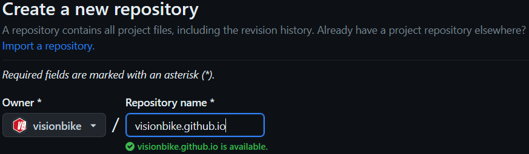
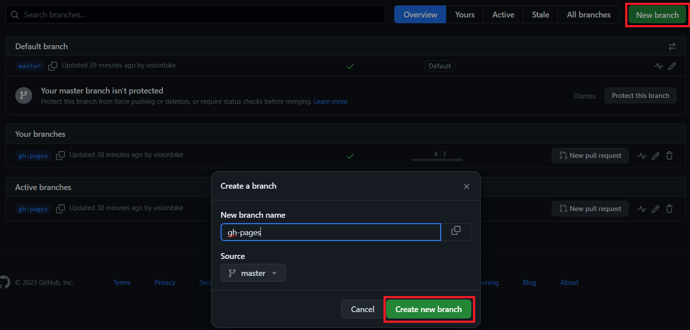
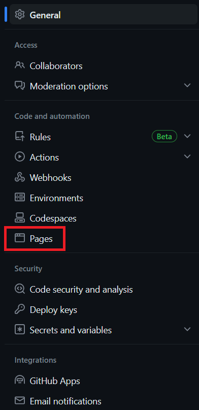
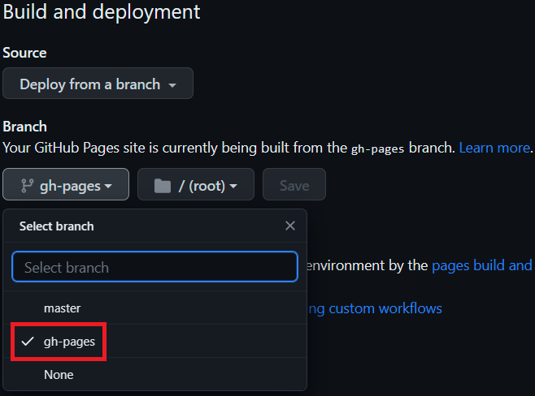
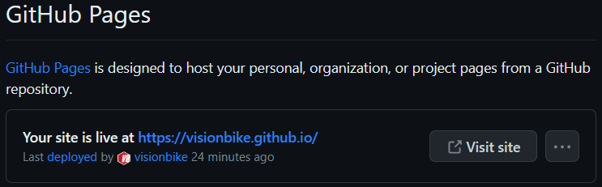
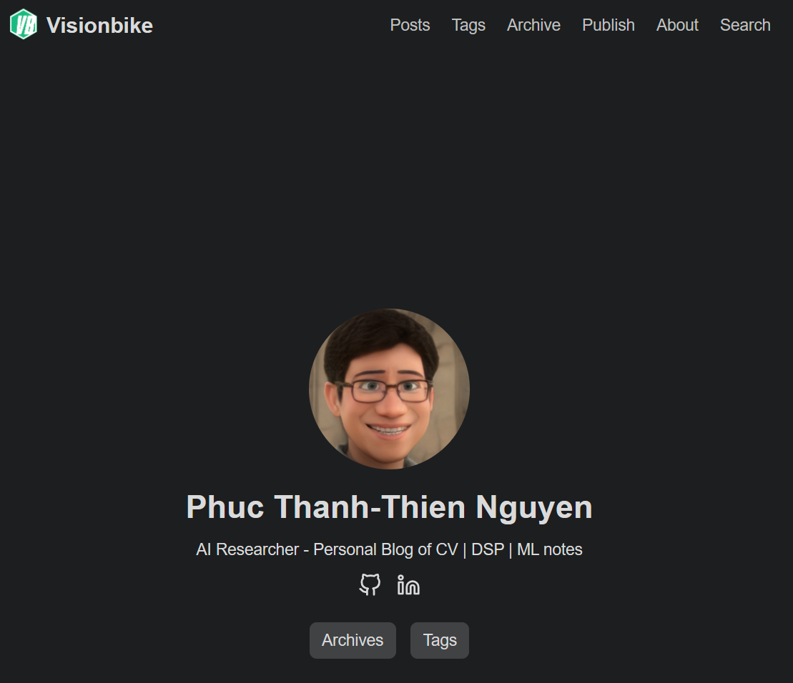

Creating a personal blog with technical content is a excellent way to enhance the writting skill, keep memorial notes and share personal experience with others. Ideally, these goals need to be achieved when creating and mantaining a blog:

1. **Low-cost** - Free or as close to free as posisble.
2. **Productive** - Easy to write and maintain.
3. **Cloud Native** - Utilizes public cloud services for hosting, allowing for infinite scaling.

After researching, I found that using **Markdown**,  **Hugo** and **GitHub Pages**  is indeed a powerful combination for creating and maintaining a cost-effective, productive, and cloud-native blog. 

* [**Markdown**](https://daringfireball.net/projects/markdown/) is markup language that is extremely easy to read, write natively and can be converted into HTML.
* [**Hugo**](https://gohugo.io/) is a static site generator written in the Go language that allows for content written in Markdown to be rendered into HTML webpages.
* [**GitHub Pages**](https://pages.github.com/) is the GitHub service that hosts web contentstored in a GitHub repository.

In this post, I will show how to create an simple personal blog for FREE using above technologies. The blog was developed in Window Subsystem for Linux (WSL2).

Here's an outline of the steps you can follow to create the personal blog using these technologies:

## 1. Setting up GitHub Account

If you don't have one already, creating a GitHub account. GitHub Pages allows you to host your blog for free using a GitHub repository.

## 2. Installing Hugo

Before starting, make sure `git` is installed in the local machine.

```bash {.command}
sudo apt install -y git
```

Configure Git with your <u>**username**</u> and <u>**email address**</u>.

```bash {.command}
git config --global user.name "Your Name"
```

```bash {.command}
git config --global user.email "your.email@example.com"
```

To verify that Git has been installed successfully, you can check the version using `git --version`. This command will display the installed version of Git.

For Ubuntu user, you can  install Hugo on your host by this command:

```bash {.command}
sudo apt install -y hugo
```

Run the folloing command for verification:

```bash {.command}
hugo version
```

The Hugo version should be shown if the installation is successfull. 

```bash
hugo v0.92.2+extended linux/amd64 BuildDate=2023-01-31T11:11:57Z VendorInfo=ubuntu:0.92.2-1ubuntu0.1
```

## 3. Creating a new Hugo site
You can run `hugo new site` command to create a new Hugo site:

```bash {.command}
hugo new site <USERNAME>-hugo -f yml
```

This command will set up the basic directory structure and configuration file in `*.yml` format for your blog.
{}
For convenient management and organization, you should name the your blog project as above format with **\<USERNAME\>** as the your GitHub's username, i.e., `visionbike-hugo`. It's helpful to keep track your project and ensuring clarity when managing multiple repositories.
{}

The site will be associated with a GitHub repository where you can store the source code of your blog. Hence, you need to initialize `git` in the local project for further use.

```bash {.command}
cd &lt;USERNAME&gt;-hugo
git init
```

You also need to create a new repository on GitHub storage for your blog's source code.



{}
By creating a repository without a **README** file, you can avoid accidental history conflicts when pushing your local project to a fresh repository. You can always add a **README** file later if needed.
{}

Now, you link the local project to the GitHub repository by the `git remote` command:

```bash {.command}
git remote add origin https://github.com/<USERNAME>/<USERNAME>.github.io.git
git banrch -M master
```

By completing these steps, you have linked your local Hugo site to the GitHub repository. Now you can continue working on your site locally, commit any changes, and push them to the remote repository when ready.

## 4. Installing Hugo Theme

Installing a Hugo theme is a fantastic way to personalize your blog and enhance its visual appeal. You can access free Hugo themes via this [**website**](https://themes.gohugo.io/).

For my blog, I chose the [**PaperModX**](https://github.com/reorx/hugo-PaperModX) theme because of fonding its style and awesome features. I added its source code by the `git submodule` command.

```bash {.command}
git submodule add --depth 1 https://github.com/reorx/hugo-PaperModX themes/PaperModX
```

The command will add the `PaperModX` theme repository as a submodule in the <u>**themes/PaperModX**</u> directory of your Hugo site.

{}
If you have already added the submodule before, you can run the following command to reclone it.

```bash {.command}
git submodule update --init --recursive
```

For updating the theme, run this command.

```bash {.command}
git submodule update --remote --merge
```
{}

## 5. Modify Hugo Configuration

Once you have added the theme, you can configure it in your Hugo site's configuration file (`config.yml`). Refer to the theme's documentation for specific instructions on customization and configuration options. You will most likely want to modify the following fields:

* <u>**baseURL**</u>: This should be set into the URL GitHub Pages for hosting your blog. If the GitHub repository is named **\<USERNAME\>.github.io**, then the value of baseURL will be **https://\<USERNAME\>.github.io/**. If the GitHub repository has any other name, then the value will be **https://\<USERNAME\>.github.io/&lt;REPOSITORY_NAME&gt;/**. For instance, my GitHub username is `visionbike`, then:
  * If the GitHub repository is named `visionbike.github.io`, then the baseURL will be `https://visionbike.github.io/`.
  * If the GitHub repository is named `visionbike-hugo`, then the baseURL will be `https://visionbike.github.io/visionbike-hugo/`.

* <u>**title**</u>: This will be the title of your blog site as it appears at the top of a visitor’s web browser when your site is open. It will also appear underneath your avatar, if one is present.

* <u>**theme**</u>: The name of the theme Hugo should use to render your site. In my example, this will be set to `PaperModX`, since that is the name of the theme I am using.

Example contents of the `config.yml` file can be found below.

{}
```yaml
# base URL
baseURL: "http://visionbike.github.io/"

# site title
title: "Visionbike - Personal Blog of CV | DSP | ML notes"

# paginate
paginate: 5

# theme config
theme: "PaperModX"
themesdir: "themes"

# global config
enableInlineShortcodes: true
enableRobotsTXT: true
buildDrafts: false
buildFuture: false
buildExpired: false
enableEmoji: true

# css minify for speeding up site
minify:
  disableXML: true
  minifyOutput: true

# site param config
params:
  # environment
  env: "production"
  description: "Visionbike - Personal Blog of CV | DSP | ML notes"

  # color scheme: auto, dark, light
  defaultTheme: "dark"
  disableThemeToggle: true

  # header logo
  logo:
    text: "Visionbike"
    icon: "images/apple-touch-icon.png"
    iconHeight: 35
    iconWidth: 35

  # profile-mode
  profileMode:
    enabled: true
    title: "Phuc Thanh-Thien Nguyen"
    subtitle: "AI Researcher - Personal Blog of CV | DSP | ML notes"
    imageUrl: "images/avatar-real.png"
    imageTitle: "avatar-real"
    imageWidth: 180
    imageHeight: 180
    buttons:
      - name: Archives
        url: /archives/
      - name: Tags
        url: /tags/
  # home-info-mode
  homeInfoParams:
    title: "Phuc Thanh-Thien Nguyen"
    content: "AI Researcher - Personal Blog of CV | DSP | ML notes"

  # home social icons
  socialIcons:
    - name: github
      url: "https://github.com/visionbike/"
    - name: linkedIn
      url: "https://linkedin.com/in/nttphuc/"

  # post config
  author: "Visionbike"
  showCodeCopyButtons: true
  displayFullLangName: true
  showReadingTime: true
  showWordCount: true
  showPostNavLinks: true
  showBreadCrumbs: true
  enableImageZoom: true

  # assets images
  assets:
    # disableFingerprinting: true
    favicon: "images/favicon.ico"
    favicon16x16: "images/favicon-16x16.png"
    favicon32x32: "images/favicon-32x32.png"
    appleTouchIcon: "images/apple-touch-icon.png"
    safarPinnedTab: "images/safari-pinned-tab.svg"

  # search page
  fuseOpts:
    isCaseSensitive: false
    shouldSort: true
    location: 0
    distance: 1000
    threshold: 0.4
    minMatchCharLength: 0
    keys: ["title", "permalink", "summary", "content"]

# laguage config
languages:
  en:
    weight: 1
    # language code
    languageCode: "en"
    # determines default content language: "en", "zh-cn", "fr", "vi", ...
    defaultContentLanguage: "en"
    # menu language
    menu:
      main:
        - name: "Posts"
          weight: 1
          url: "/posts/"
        - name: "Tags"
          url: "/tags/"
          weight: 3
        - name: "Archive"
          url: "/archives/"
          weight: 4
        - name: "Publish"
          url: "/publish/"
          weight: 5
        - name: "About"
          weight: 10
          url: "/about/"
        - name: "Search"
          weight: 100
          url: "/search/"

# for search page
outputs:
  home:
    - HTML
    - RSS
    - JSON

# syntax highlight
pygmentsUseClasses: true
pygmentsCodeFences: true
markup:
  goldmark:
    renderer:
      unsafe: true
    highlight:
      lineNos: false
      codeFences: true
      noClasses: false
```
{}

After modifying the configuration file accordingly, you can commit and push changes from your local repository to GitHub.

```bash {.command}
git add config.yml
git commit -m "modify configuration file"
git push -u origin master
```

## 6. Creating New Hugo Post

You are almost done finishing your personal blog! 

To create the first post, you execute the `hugo new` command in the terminal.

```bash {.command}
hugo new posts/first-post/index.md
```

The command will create a new folder named `first-post` with new Markdown file `index.md`, inside the <u>**content/posts**</u> directory. Creating a new directory for each single post helps you manage your resource better when images, media sources can be store directly in this directory. The Markdown file will contain the template for your first blog post and you can start  writing your content using Markdown syntax.

The contents of the `first-post.md` file will look like as:

{}
```markdown
---
title: "First Post"
date: 2023-07-04T01:53:57+08:00
draft: true
---
```
{}

You need to add content to the Markdown file and update the metadata header. In the metadata header, you will find information such as the post's title, publishing date and draft status. Change the value of the **draft** field from `true` to `false` to indicate that the post is ready to be published on your blog site. Your can also add other features supported by the installed theme for your post, i.e., comments, share buttons, navigation, etc.

The, you add the desired content to the body of the post. For instance, I added the line **"This is my first post! Hello world!"** at the bottom of the file. Feel free to customize the content to reflect your own thoughts and ideas in Markdown syntax.

After modifying the first blog post, you can use `git commit` to commit and push the changes from your local repository to GitHub.

```bash {.command}
git add content/posts/first-post.md
git commit -m "add the first post"
git push -u origin master
```

## 7. Testing the Hugo Configuration

Before hosting your blog to GitHub pages, make ensure Hugo can parse the configuration file and build our new blog post successfully. 

In the local machine, you can run `hugo server` command to serve your site locally. 

```bash {.command}
hugo server --disableFastRender
```

It will watch for any changes in your files and automatically rebuild your site whenever there are updates. Hugo will provide a local development server address, i.e., `http://localhost:1313`, where you can access your site locally.

To parse the configuration and build your site, you simply run `hugo` command. 

```bash {.command}
hugo
```

If Hugo encounters any errors, they will be reported here. If the site is successfully built, then you will see output similar to the following.

```bash
Start building sites … 
hugo v0.92.2+extended linux/amd64 BuildDate=2023-01-31T11:11:57Z VendorInfo=ubuntu:0.92.2-1ubuntu0.1

                   | EN  
-------------------+-----
  Pages            | 13  
  Paginator pages  |  0  
  Non-page files   |  0  
  Static files     | 18  
  Processed images |  0  
  Aliases          |  0  
  Sitemaps         |  1  
  Cleaned          |  0  

Total in 38 ms
```

## 8. Setting Up GitHub Actions Workflow

Lastly, the GitHub Actions workflow has to be prepared for automatically building and deploying your blog to GitHub Pages. This workflow is defined by a YAML file in the <u>**.github/workflows**</u> directory structure at the root of the project. 

First, create the `workflows` folder.

```bash {.command}
mkdir -p .github/workflows
```

The command will create the <u>**.github/workflows**</u> directory if it doesn't already exist. The `-p` option ensures that the parent directories are created if needed. 

Then, we create a new file within the created folder directory, named `deploy_gh_pages.yaml` with the following contents.

{}
```yaml
---
---
name: Deploy Hugo site via GitHub Pages

on:
  push:
    branches:
      - master # Set a branch to deploy
  pull_request:

jobs:
  deploy:
    runs-on: ubuntu-22.04
    permissions:
      contents: write
    concurrency:
      group: ${{ github.workflow }}-${{ github.ref }}
    steps:
      - uses: actions/checkout@v3
        with:
          submodules: true # Fetch Hugo themes (true OR recursive)
          fetch-depth: 0 # Fetch all history for .GitInfo and .Lastmod

      - name: Setup Hugo
        uses: peaceiris/actions-hugo@v2
        with:
          hugo-version: "latest"
          extended: true

      - name: Build
        run: hugo --minify

      - name: Deploy
        uses: peaceiris/actions-gh-pages@v3
        # If you're changing the branch from main,
        # also change the `master` in `refs/heads/master`
        # below accordingly.
        if: github.ref == 'refs/heads/master'
        with:
          github_token: ${{ secrets.GITHUB_TOKEN }}
          publish_dir: ./public
```
{}

The YAML file sets up the deployment process using Hugo and GitHub Pages. The workflow is triggered on a push to the `master` branch, and it uses the specified actions to build and deploy your blog. You can find more in [**this**](https://github.com/peaceiris/actions-gh-pages).

Finally, we use `git` commands to commit and push the changes from your local repository to GitHub.

```bash {.command}
git add .github/workflows/deploy_gh_pages.yaml
git commit -m "Add GitHub Actions workflow"
git push -u origin master
```

## 9. Configuring GitHub Pages

The GitHub Pages will allow GitHub to build automatically and serve our website whenever changes are made to the underlying repository.

First, we create new branch named `gh-page`. This branch will be used by GitHub Pages to build and serve your website. You can create the branch using the branch creation feature in your GitHub repository.



Then, go to the `Settings` tab near the top of your repository.


In the left hand pane, locate and click on the `Pages` category.



By default, GitHub Pages will be disabled for your repository. To enable it, we need to select a branch for GitHub Pages to build and serve our website from. Under the `Source` section in the middle pane, you will see a dropdown menu labeled `None`. Click on the dropdown menu and select the `gh-pages` branch. This tells GitHub Pages to build and serve your website from the `gh-pages` branch.



After selecting the deployment branch, you will see a notification indicating where your site will be published. It will provide you with a URL where your website can be accessed.



Wait for a few minutes to allow GitHub Pages to build and deploy your website. When the deployment completes, you can click on the URL provided in the notification to view your website. It may take some time for the changes to propagate and for your website to become accessible.



## Conclusion

Congratulations on setting up your blog using **Hugo**, **Markdown**, and **GitHub Pages**! This free and accessible solution enables you to create and share your technical knowledge with a wide audience. Happy blogging!

## Reference

- [How to Create a Simple, Free Blog with Hugo and GitHub Pages](https://chrisjhart.com/Creating-A-Simple-Free-Blog-Hugo/).

- [https://github.com/reorx/hugo-PaperModX](https://github.com/reorx/hugo-PaperModX).

- [https://gohugo.io/](https://gohugo.io/).

- [https://github.com/olOwOlo/hugo-theme-even/](https://github.com/olOwOlo/hugo-theme-even/).