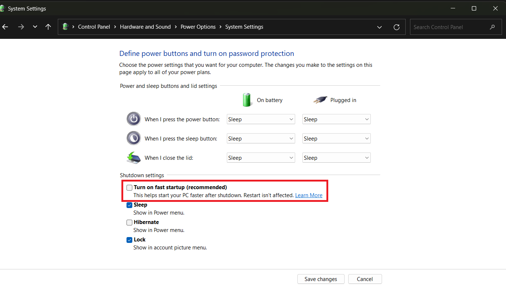
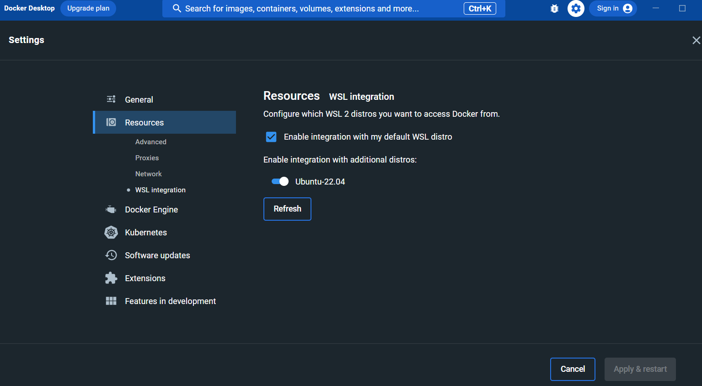
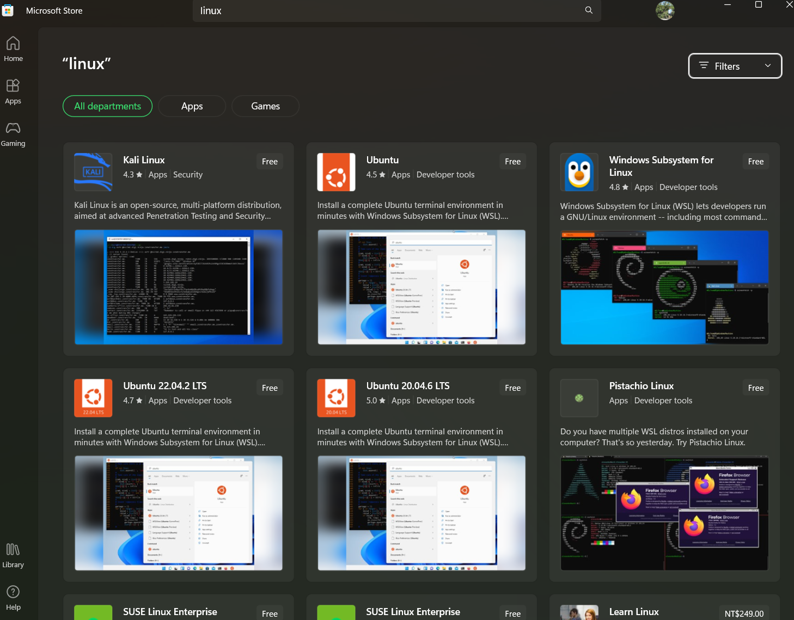
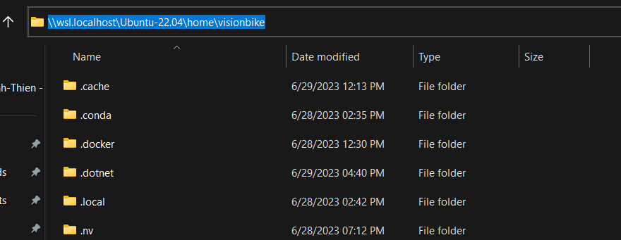
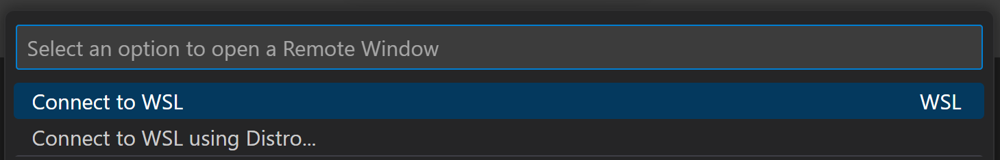

**Windows Subsystem for Linux (WSL)** is a compatibility layer provided by Microsoft that allows you to run a Linux environment directly on your Windows operating system. It enables you to execute Linux binaries, use Linux command-line tools, and access Linux file systems from within Windows.

When it comes to machine learning (ML) development, WSL offers several advantages:

1. **Linux Compatibility**: Many ML frameworks, libraries, and tools are primarily developed and optimized for Linux systems. By using WSL, you can seamlessly run Linux-specific ML software on your Windows machine without the need for dual-booting or setting up a separate Linux machine.

2. **Access to Linux Packages**: WSL provides access to the extensive collection of Linux packages available in various package managers (e.g., APT, YUM, and others). This allows you to easily install and manage Linux dependencies required for your ML projects.

3. **Command-Line Tools and Scripts**: ML development often involves working with command-line tools and executing scripts. WSL provides a Linux shell environment, enabling you to run Linux commands and scripts directly on your Windows machine. This ensures compatibility and smooth execution of ML workflows that rely on Linux-specific commands and scripts.

4. **Compatibility with Docker**: Docker is widely used in ML development to create isolated environments for running ML applications. WSL provides a seamless integration with Docker, allowing you to run Linux-based Docker containers on your Windows machine without any performance overhead.

5. **Consistency across Development Environments**: If you work in a team where some members use Linux for ML development, using WSL allows you to maintain consistency across different development environments. It ensures that code, scripts, and configurations work consistently regardless of the underlying operating system.

By utilizing WSL, you can leverage the power of Linux for ML development while enjoying the convenience of working within the Windows environment. It bridges the gap between Windows and Linux, making it easier to set up and manage a Linux-based ML environment on your Windows machine.

It is important to note that WSL is available in different versions, such as WSL 1 and WSL 2. WSL 2 offers enhanced performance and better integration with the Windows system, making it the recommended choice for ML development. The WSL 2 is fully integrated in Windows 10 build 19041 or Windows 11, so you may consider upgrade your system before install it.

{}
You can check Window version by going to **Settings > System > About** and scroll down to **Windows specifications**.
{}

If you plan to work with Linux-based ML frameworks, libraries, or tools, using WSL can significantly streamline your development workflow and ensure compatibility with the wider ML community.

## 1. PC Requirements

WSL 2 uses **Hyper-V** which requires harware virtualization support enabled in your BIOS. To ensure the hardware virtualization is available on your device, you can check by rebooting, pressing `DEL`, `F2` or `F10` (depending on the hardware manufacture) to open the BIOS pannels. Lokking for **Virtualization Technology**, **VTx**, **Secure Virtual Machine (SVM)** or similar options and ensure these options enabled, then reboot the machine.

{}
Fast start-up saves Windows session and device drivers to a file so the next boot become faster. However, this can cause problems for Linux kernel, which may unresponsive on the next boost. If you encounter this problem, you can disable tthe fast start-up option by **Control Panel > Power Options > Choose what the power buttons do > Change settings that are currently unavailable**


{}

## 2. Install Docker Desktop

**Docker Desktop** with WSL 2 provides an efficient and seamless integration between Docker containers and the WSL 2 environment. This combination allows you to run Linux containers directly on your Windows system, leveraging the power of WSL 2.

If you haven't installed Docker Desktop yet, please download and install the Docker Desktop for Windows from the [Docker website](https://www.docker.com/products/docker-desktop/). Installing Docker Desktop on Windows enables docker and docker-compose in both Windows and WSL 2.

Docker Desktop suggests you use WSL 2 when it's first launched. Alternatively, you can select **Settings** from the Docker system tray icon menu, then choose the **General** tab, check **Use the WSL 2 based engine**, and hit **Apply & Restart**. Docker uses the default Linux distro, but you can also enable it in other installed distros from the **WSL Integration** panel in **Settings**, then **Resources**.



Once Docker Desktop is installed, you can verify that it is running correctly by following command from `PowerShell` or `Command Prompt`:

```ps
docker version
```

This command displays the Docker version and confirms that Docker is running with WSL 2 integration.

By combining Docker Desktop with WSL 2, you can take advantage of the containerization capabilities of Docker while benefiting from the compatibility and performance enhancements of WSL 2. It allows for efficient development and deployment of applications in a Linux environment, even if you're working on a Windows system.

## 3. Install Windows Terminal

**Windows Terminal** is a powerful and customizable terminal application for Windows that provides a modern and feature-rich command-line experience.  It allows you to interact with various shells and command-line tools in a single window, making it convenient for developers and system administrators. It is available from the **Microsoft Store** or it repository at [github.com/microsoft/terminal/](github.com/microsoft/terminal/).

Windows Terminal automatically adds WSL 2 Linux distros when they're installed and offers a configurable range of options including tabs, split views, themes, transparency, and key bindings.

## 4. Install Windows Subsystem for Linux 2 (WSL 2)

To display a list of available WSL Linux distros, you can run followinf command in `PowerShell` in **adminitror mode**:

```ps
wsl --list --online
```

To install the default Ubuntu distro (the latest version), run:

```ps
wsl --install
```

If you want to install a specific distro by name, such as `Ubuntu-22.04`, run:

```ps
wsl --install -d Ubuntu-22.04
```

{}
Alternaltively, you can install Linux distro from the **Microsoft Store**.


{}

Once the installation is done, you will be prompted to enter a username and password. These are the credentials for Linux administration and completely separately from your Windows username.
```shell
Please create a default UNIX user account. The username does not need to match your Windows username.
For more information visit: https://aka.ms/wslusers
Enter new UNIX username: Visionbike
New password:
Retype new password:
paddwd: password updated successfully
Installation successful!
```
Linux will eventually be ready and your terminal will show content similar to:

```shell
To run a command as administrator (user "root"), use "sudo <command>".
See "man sudo_root" for details.

Welcome to Ubuntu 22.04.2 LTS (GNU/Linux 5.15.90.1-microsoft-standard-WSL2 x86_64)

 * Documentation:  https://help.ubuntu.com
 * Management:     https://landscape.canonical.com
 * Support:        https://ubuntu.com/advantage

 * Strictly confined Kubernetes makes edge and IoT secure. Learn how MicroK8s
   just raised the bar for easy, resilient and secure K8s cluster deployment.

   https://ubuntu.com/engage/secure-kubernetes-at-the-edge

This message is shown once a day. To disable it please create the
/home/visionbike/.hushlogin file.
```

For the first start, we should to install several Linux updates. The process will depend on the speed of the internet, so be patient if it slow!

```shell
sudo apt update && sudo apt upgrade
```

You can also to check for Linux kernel updates from `PowerShell` running:

```ps
wsl --update
```

{}
To check if the installation was successful, you can run the following command in `PowerShell`:

```ps
wsl -l -v
  NAME                   STATE           VERSION
* Ubuntu-22.04           Running         2
  docker-desktop         Stopped         2
  docker-desktop-data    Stopped         2
```
{}

## 5. Working with WSL 2

### Set a Default Linux Distribution

If you have more than one WSL Linu distro, you need to set the most frequent used distro as a default one. To set the default distro, run the following command in **PowerShell** temrinal.

```ps
wsl --setdefault <DISTRONAME>
```

where `<DISTRONAME>` is the distro's name you installed.

### File System in WLS 2

In WSL 2, the Linux file system is located within the WSL 2 virtual machine. It provides a Linux-compatible file system hierarchy, including the root directory (`/`) and various standard directories, such as `/home`, `/usr`, and `/var`. These directories and their subdirectories contain the files and directories specific to the Linux environment.

The WSL 2 file system integration ensures that Linux processes can access and manipulate files stored on the Windows file system. This means you can work with files and directories in both the Linux and Windows environments seamlessly. For example, you can create, modify, and delete files from within WSL 2, and those changes will be reflected in the corresponding Windows directories and vice versa.

Windows drives are mounted in the Linux `/mnt/` directory. For instance, you can access `Users` folder a `C:\User\` by running in WSL terminal:

```shell
cd /mnt/c/Users/
```

Noting that accessing Windows files from Linux is considerably slower than using the native Linux file system. Where possible, create projects in the Linux file space, typically in your home folder (`/home/<USERNAME>` or `~`).

You can also access WSL 2 files from the network path `\\wsl$\` in Windows's **File Explorer**.



{}

For ease of access, you can create a Linux symbolic link to any Windows folder from the terminal. For example, for `C:\projects\`:

```shell
cd ~
ln -s /mnt/d/projects/
```

A `projects` folder will appear in your Linux home directory. Navigate to it using cd `~/project` and you'll actually be in `/mnt/d/projects/`, which maps directly to `D:\projects\`.
{}

### Move or Clone Your WSL Linux Disk Image

WSL Linux disk images are installed on your `C:` drive in deault. This may occupy a lot of space in the Windows's system drive. Optionally, you can either move it to another drive to free up space on `C:`, or use the same image to create multiple Linux installations (which can be useful **if you need different applications and setups for different projects** - although Docker may be more practical).

Presume that you are moving the Ubuntu Linux distro to `D:\wsl`. In a **Powershell** terminal, then export Linux distro you want to move by name to a backup `.tar` file, such as `D:\backup\ubuntu-22.04.tar`.

```ps
mkdir D:\backup
wsl --expoer Ubuntu-22.04 D:\backup\ubuntu-22.04.tar
```

Then, unregister that distro to remove it by name from the `C:` drive.

```ps
wsl --unregister Ubuntu-22.04
```

You can run `wsl -l` to verify the distro has been removed. Now, you can import the new WSL 2 distro at another location, such as `D:\wsl`.

```ps
mkdir D:\wsl
wsl --import Ubuntu-22.04 D:\wsl\ D:\backup\ubuntu-22.04.tar
```

You can make any number of named clones from the same back-up by changing the name of distro after `--import` argument.

Again, verify the WSL distro has been successfully created by `wsl -l` command. At this point, Ubuntu will use root as the default user. To revert to your own account, run the following command:

```ps
ubuntu config --default-user <USERNAME>
```

where `<USERNAME>` is the username you defined before.

For other distros that aren't the WSL2 default distro, you need to log on to the distro and create/edit `/etc/wsl.conf` file.

```shell
nano /etc/wsl.conf
```

Add the following lines to the file

```bash
[user]
default=<USERNAME>
```

Save the file, then restart the distro in **PowerShell** terminal.

```ps
wsl --terminate <DISTRONAME>
```

where `<DISTRONAME>` is the distro's name you installed. Now you can feel free to delete backup file if you want.

{}
To save the file use `Ctrl + S` combination while `Ctrl + X` is use to exit the editor in terminal.
{}

### Visual Studio Code with WSL 2 Integration

[**Visual Studio Code (VS Code)**](https://code.visualstudio.com/) permits you to use any Windows or Linux terminal. In VS Code, you need to install **WSL** extension (search in **Extensions** tab). The WSL extension enables you to run VS Code within the WSL.


When the WSL extension si installed, you will see a new **Remote Status** bar item at the far left.


The Remote Status bar item can quickly show you in which context VS Code is running (local or remote).


To open new remote WSL window, you can press `F1` to open **Command Pallete** in VS C and type **WSL** to select the option.



## Conclusion

Working with WSL 2 on Windows 11 offers an improved experience for running Linux applications. With WSL 2, you can seamlessly integrate Windows and Linux environments, allowing you to develop and execute code using Windows tools while leveraging the power of a Linux-based runtime. This integration simplifies web development, eliminates the need for virtual machines, and provides a more efficient workflow. Overall, WSL 2 on Windows 11 offers the benefits of both operating systems, enhancing productivity and making it easier to work with Linux applications on a Windows platform.

## Reference

- [Windows Subsystem for Linux Documentation](https://learn.microsoft.com/en-us/windows/wsl/).
- [Windows Subsystem for Linux 2: The Complete Guide for Windows 10 & 11](https://www.sitepoint.com/wsl2/).
- [Remote development in WSL](https://code.visualstudio.com/docs/remote/wsl-tutorial).
- [How to Create a Perfect Machine Learning Development Environment With WSL2 on Windows 10/11](https://towardsdatascience.com/how-to-create-perfect-machine-learning-development-environment-with-wsl2-on-windows-10-11-2c80f8ea1f31).